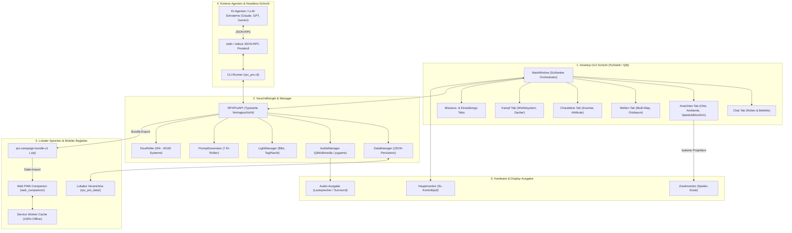
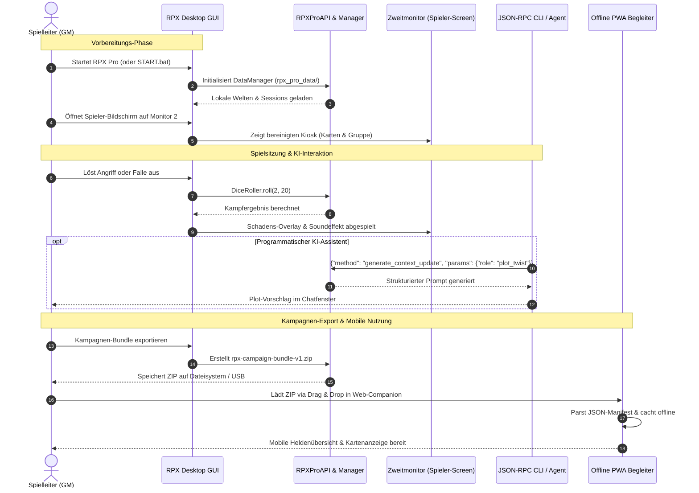

# RPX Pro — RolePlay Xtreme Professional Edition

[English](README.md) | [Deutsch](README_de.md)

[](https://github.com/entertain-and-more/rpx/releases)
[](store_package.json)
[](SECURITY.md)
[](tests/)
[](web_companion/)
[](https://www.qt.io/)
[](https://www.python.org/)
[](https://github.com/entertain-and-more/rpx)
[](#16-drittanbieter-lizenzen--governance)
[](SECURITY.md)
[](SECURITY.md)
[](THIRD_PARTY_LICENSES.md)
[](MARKETING-LOG.txt)
[](https://github.com/astral-sh/ruff)
[](llms.txt)
[](LICENSE)
[](https://github.com/entertain-and-more)
[](https://github.com/open-bricks)

> Professionelles Rollenspiel-Kontrollzentrum für Pen & Paper Tabletop-Abenteuer. Offline-fähig, kostenlos und Open Source.

### Release-Metadaten

| Feld | Wert |
|------|------|
| Anwendungsversion | `1.0.0` |
| Store-Paketversion | `1.0.0.0` |
| Release-Status | **Unreleased / Unveröffentlicht** (rechtliche und Store-Freigabe ausstehend) |
| Herausgeber | Geiger (`CN=52596601-BAB4-4F3F-B182-E8F3F273B202`) |
| Datenschutzerklärung | [PRIVACY_POLICY.md](https://github.com/entertain-and-more/rpx/blob/master/PRIVACY_POLICY.md) |
| Support | [GitHub Issues](https://github.com/entertain-and-more/rpx/issues) |
| Datenschutzprüfung | `2026-08-10` |

Datenschutzgrenze: Es gibt keine automatische Datenerhebung oder Übertragung. Kampagnendaten bleiben lokal; Prompts für ein externes KI-Tool bzw. einen externen KI-Anbieter werden lokal kopiert oder angezeigt und verlassen das Gerät nur, wenn die nutzende Person dieses Tool ausdrücklich verwendet.

> [!NOTE]
> **Local-First & Maschinenlesbare Architektur**: RPX Pro läuft zu 100% offline. Alle Kampagnendaten, Karten, Audiodateien und Regelwerke verbleiben lokal in `rpx_pro_data/`. Für KI-Agenten und externe LLM-Workflows bietet RPX Pro eine abhängigkeitsfreie JSON-RPC CLI (`python -m rpx_pro.app --cli`) über `stdin`/`stdout` sowie standardisierte `rpx-campaign-bundle-v1` ZIP-Exporte für den offline PWA-Companion in `web_companion/`.

---

## Schnellnavigation

1. [Übersicht](#1-übersicht)
2. [Hauptfunktionen](#2-hauptfunktionen)
3. [Zielgruppen & Auffindbarkeit](#3-zielgruppen--auffindbarkeit)
4. [Vergleichsmatrix gegenüber Alternativen](#4-vergleichsmatrix-gegenüber-alternativen)
5. [Governance- & Laufzeit-Invarianten](#5-governance--laufzeit-invarianten)
6. [Visuelle Architektur](#6-visuelle-architektur)
7. [Session-Lebenszyklus & Workflow](#7-session-lebenszyklus--workflow)
8. [Spieler-Bildschirm (Zweitmonitor)](#8-spieler-bildschirm-zweitmonitor)
9. [CLI & API für LLM-Integration](#9-cli--api-für-llm-integration)
10. [Web-Companion PWA](#10-web-companion-pwa)
11. [Simulation & Spielmechaniken](#11-simulation--spielmechaniken)
12. [Regelwerk-System & Vorlagen](#12-regelwerk-system--vorlagen)
13. [Installation & Schnellstart](#13-installation--schnellstart)
14. [Entwicklung & Test-Suite](#14-entwicklung--test-suite)
15. [Geschwister-Ökosystem-Matrix](#15-geschwister-ökosystem-matrix)
16. [Drittanbieter-Lizenzen & Governance](#16-drittanbieter-lizenzen--governance)
17. [Sicherheit & Release-Metadaten](#17-sicherheit--release-metadaten)
18. [Lizenz & Haftung](#18-lizenz--haftung)

---

<a id="1-übersicht"></a>
## 1. Übersicht

RPX Pro (RolePlay Xtreme Professional Edition) ist ein umfassendes Open-Source-Desktop-Kontrollzentrum für Spielleiter (Game Masters / DMs) von Pen & Paper Tabletop-Rollenspielen. Entwickelt mit Python 3.10+ und PySide6 (Qt6), beendet RPX Pro das Chaos unzähliger Browser-Tabs, PDF-Regelwerke, Cloud-Abonnements und externer Soundboard-Tools während der Spielsitzung.

### Desktop-UI-Sprachvertrag

Der Desktop-Übersetzer arbeitet ausschließlich mit festen UI-Schlüsseln. Die
Sprachslots sind `de`, `en`, `es`, `zh-Hans`, `ja` und `ru`. Spanisch (`es`) ist
die erste kuratierte Zusatzsprache; die CJK-Slots bleiben bis zu UTF-8-,
Schrift- und Layout-Smokes reserviert. Regelwerk-, Kampagnen-, Charakter-,
Orts- und Lore-Texte sind nutzergeführt und werden nicht automatisch übersetzt.
Das ist im Code durch `TranslationSystem.translate_ui(key)` und den unveränderten
`TranslationSystem.translate_content(text)`-Pfad getrennt.

#### Zusatzsprachen: Kuratierungs- und Stop/Go-Matrix

Die Sprachreihenfolge folgt dem RPX-Usecase und nicht einer pauschalen
Vollübersetzung:

| Reihenfolge | Slot | Zielgruppe und UI-Scope | Go-Gate | Entscheidung |
|---|---|---|---|---|
| Basis | `de`, `en` | Spielleitung und internationale Entwickler; fester Desktop-UI-Katalog | Katalog-Parität, UTF-8-Readback und Fallback-Test | Aktiv |
| 1 | `es` | Spanischsprachige Spielleitungen und Spieler; feste UI-Aktionen und Statusmeldungen | Kuratierte Schlüssel, UTF-8-Readback, keine abgeschnittenen UI-Texte; `tests/test_translation_contract.py` | Erste Zusatzsprache, schrittweise |
| 2 | `zh-Hans` | Chinesischsprachige Desktop-Nutzer bei belegtem Bedarf; nur feste UI | Belegter Bedarf plus UTF-8-, Schrift-/Glyphen- und Layout-Smoke mit langen Labels | Reserviert |
| 3 | `ja` | Japanischsprachige Desktop-Nutzer bei belegtem Bedarf; nur feste UI | Belegter Bedarf plus UTF-8-, Schrift-/Glyphen- und Layout-Smoke mit langen Labels | Reserviert |
| 4 | `ru` | Russischsprachige Desktop-Nutzer bei belegtem Bedarf; nur feste UI | Belegter Bedarf plus UTF-8-, Schrift-/Glyphen- und Layout-Smoke mit langen Labels | Reserviert |

Ein UI-Schlüssel ist ein stabiler fester Katalogeintrag (für den Legacy-Katalog
in der Regel der deutsche Ausgangstext) und wird über `translate_ui(key)` gelesen.
Der Fallback ist deterministisch: aktueller Slot, bei Spanisch die kuratierte
UI-Tabelle, dann Englisch, Deutsch und zuletzt der Schlüssel selbst. Freie
Regelwerks-, Kampagnen-, Charakter-, Orts-, Lore- und Chat-Inhalte laufen über
`translate_content(text)` unverändert durch. Bundle-Export und -Import bewahren
diese Inhalte byte-/textgetreu; nur technisch erforderliche Medienpfade werden
für das portable Bundle normalisiert.

Stop-Gates sind fehlende Katalog-Parität, nicht lesbares UTF-8, fehlende
Glyphen, abgeschnittene oder überlappende Labels, eine automatische Übersetzung
freier Inhalte oder ein veränderter Bundle-Inhalt. Bei einem Stop bleibt der
Sprachslot reserviert und es gibt keine Massenübersetzung. Ein Go erfordert den
vollständigen Schlüssel-Smoke, den Daten-Grenztest und für mobile Nutzung den
separaten Android-/iOS-PWA-Praxisnachweis; statische Node- oder Python-Tests
allein zählen dort nicht als Geräte-Smoke.

Die Software basiert auf einem kompromisslosen Local-First-Architekturprinzip: Jede Kampagnenwelt, jedes Kartenbild, jeder Soundeffekt, jeder Charakterbogen und jedes Transaktionsprotokoll wird ausschließlich auf dem lokalen Dateisystem unter `rpx_pro_data/` gespeichert. Es ist keine Registrierung erforderlich, kein externer Server wird kontaktiert und keine Kampagnennotizen verlassen das Gerät ohne ausdrücklichen Exportbefehl.


---

<a id="2-hauptfunktionen"></a>
## 2. Hauptfunktionen

| Feature | Beschreibung |
|---------|-------------|
| **Welten-System** | Multi-Map-Kartenhierarchien, Außen- und Innenansichten von Orten, Nationen-Lore, Völker, Trigger-Automatisierung |
| **Soundboard** | Multi-Backend-Audio-Engine (Qt Multimedia, pygame, winsound Fallback) mit Drag-and-Drop-Triggern |
| **Lichteffekte** | Dynamische Blitz-Effekte, Stroboskop, Tag/Nacht-Farbfilterung (synchron auf den Spieler-Bildschirm gespiegelt) |
| **Kampfsystem** | Initiativesteuerung, Mehrfachwürfel (W4–W100), kritische Treffer, Rüstungsausgleich, Waffen- und Zauberverwaltung |
| **Spieler-Bildschirm** | Eigener Zweitmonitor-Bildschirm mit Kachel-, Karten-, Rotations- und Bildmodus bei verdeckten Spielleiter-Notizen |
| **Regelwerk-Import** | Mitgelieferte D&D 5e (SRD 5.1), DSA 5 (abstrahiert) und Generic Fantasy Vorlagen, plus freier JSON-Import |
| **KI-Integration** | Prompt-Generator mit 7 spezialisierten Rollenspiel-Rollen; kopierbare Prompts ohne automatische Cloud-Übertragung |
| **CLI / API für Agenten**| Abhängigkeitsfreie JSON-RPC-CLI über `stdin`/`stdout` für autonome KI-Agenten und kopflose Automationen |
| **PWA Web-Begleiter** | Statische clientseitige PWA zum Offline-Lesen lokaler `rpx-campaign-bundle-v1` ZIP-Archive auf Mobilgeräten |
| **Session-Manager** | Quests/Missions-Logging, Gruppenverwaltung, Rundenweiterschaltung, automatische Chat-Befehlsprotokollierung |
| **Charakter-Verwaltung** | Detaillierte Attributverwaltung, Inventar-Dialog mit Gewichts- und Goldgrenzen, Avatar-Vorschau, Hunger/Durst |
| **Lebendige Simulation**| Konfigurierbare Spielzeit-Raten, Hunger-/Durst-Abbau und zufällige Naturkatastrophen-Ereignisse |

---

<a id="3-zielgruppen--auffindbarkeit"></a>
<a id="zielgruppen--auffindbarkeit"></a>
<a id="target-personas--discoverability"></a>
## 3. Zielgruppen & Auffindbarkeit

RPX Pro wurde für vier zentrale Zielgruppen im Bereich Tabletop-Gaming und Open-Source-Entwicklung konzipiert:

| Persona-ID | Zielgruppe | Kernanforderung | RPX Pro Architekturlösung |
|---|---|---|---|
| `[PERSONA-01]` | **Pen & Paper Spielleiter (GMs / DMs)** | All-in-One Kontrollzentrum für Live-Runden mit Karten-Projektion, Soundboard, Licht-Atmosphäre und Gruppenstatus. | Integriertes Soundboard, Multi-Map-Manager mit Außen-/Innenansichten, Kampfwürfler, Lichteffekte und separater Spieler-Zweitmonitor. |
| `[PERSONA-02]` | **Datenschutzbewusste Spieler & Weltenbauer** | Absolute Datensouveränität, Offline-Verfügbarkeit und Privatsphäre für eigene Kampagnen, Lore und Hausregeln. | Strikte 100% Offline-Architektur ohne Cloud-Zwang (`rpx_pro_data/`), MIT-Lizenz und portable `rpx-campaign-bundle-v1` ZIP-Exporte. |
| `[PERSONA-03]` | **Autonome KI-Entwickler & LLM-Tool-Bauer** | Programmierbare Headless-API zur Orchestrierung von KI-Dungeon-Mastern, NPC-Dialogen oder Kampagnen-Inspektion. | Standardisiertes JSON-RPC CLI-Protokoll über `stdin`/`stdout` (`python -m rpx_pro.app --cli`) mit typisierten Methoden ohne GUI-Abhängigkeiten. |
| `[PERSONA-04]` | **Mobile Begleiter & Tablet-Nutzer am Spieltisch** | Einsehen von Charakterwerten, Zauberslots und Quests am Spieltisch ohne Server-Setup oder Cloud-Abos. | Serverlose statische PWA Begleit-App (`web_companion/`) parst `rpx-campaign-bundle-v1` ZIP-Dateien clientseitig via Service Worker. |

### Suchbegriffe & Auffindbarkeit

Zur Auffindbarkeit in Entwickler-Verzeichnissen, Paketmanagern und Suchmaschinen:
- `Open Source Pen and Paper Spielleiter Kontrollzentrum Python PySide6` — Vollständige Offline-Workstation für Spielleiter.
- `Offline Virtual Tabletop Werkzeuge mit Zweitmonitor Spielerbildschirm` — Multi-Monitor Session-Runner ohne Abo-Kosten.
- `Lokales Kampagnenverwaltungsprogramm ohne Cloud-Zwang und Telemetrie` — Privater Session-Manager mit lokaler Datenspeicherung.
- `JSON-RPC CLI Pen and Paper Schnittstelle für KI Agenten und LLM` — Headless Programmierschnittstelle für KI-Spielleiter.
- `rpx-campaign-bundle-v1 Kampagnen-Export PWA Begleit-App` — Plattformunabhängige Kampagnen-Spezifikation und mobiler Betrachter.
- `PySide6 Qt6 Pen and Paper Spielrunden-Manager` — Desktop-Architektur mit Qt6-Signalen und Dataclass-Modellen.
- `D&D 5e DSA Generisches Fantasy Offline Spielleiter Software` — SRD-konforme Regelwerk-Vorlagen mit JSON-Erweiterbarkeit.
- `Multi-Backend Soundboard und Lichteffekte für Rollenspielrunden` — Atmosphärische Multimedia-Integration für Spielsitzungen.

---

<a id="4-vergleichsmatrix-gegenüber-alternativen"></a>
<a id="vergleichsmatrix-gegenüber-alternativen"></a>
<a id="comparative-matrix-vs-alternatives"></a>
## 4. Vergleichsmatrix gegenüber Alternativen

Die folgende Matrix vergleicht RPX Pro mit gängigen Virtual-Tabletop-Lösungen und Behelfswerkzeugen anhand von 10 technischen Dimensionen, die direkt mit unseren Governance-Invarianten verknüpft sind:

| Technische Dimension | Governance-Invariante | RPX Pro | Roll20 (Cloud SaaS VTT) | Foundry VTT (Self-Hosted Node.js) | Fantasy Grounds (Kommerzieller Desktop) | Manuelles Pen & Paper / Tools (Papier, Obsidian, Syrinscape) |
|:---|:---:|:---:|:---:|:---:|:---:|:---:|
| **1. Offline-First & Zero Egress** | `INV-LOCAL-01` | **100% Offline (Lokale Daten in `rpx_pro_data/`, 0 Telemetrie)** | Keine (Zwingende Cloud-Verbindung & Remote-Hosting) | Partiell (Erfordert lokalen Webserver & Portfreigaben) | Partiell (Desktop-App mit zwingender Lizenzprüfung online) | Hoch (Physisches Papier oder lokale Markdown-Notizen) |
| **2. Unprivilegierte Ausführung** | `INV-USER-02` | **Striktes RunAsInvoker (Keine Administrator-Rechte nötig)** | Browser-Sandbox | Node.js Daemon (mögliche Firewall- & Port-Meldungen) | Windows-Installer mit administrativen Rechten | Manuelle Dateiablage |
| **3. Zweitmonitor-Spieleranzeige** | `INV-DUAL-03` | **Nativer Zweitmonitor (Kiosk/Kacheln/Rotation mit SL-Trennung)** | Keine (Zweiter Browser-Tab mit Spieler-Login nötig) | Keine (Zweites Browser-Fenster mit Spieler-Login nötig) | Partiell (Zweite Instanz lokal verbunden) | Keine (Manueller Sichtschutz / Pappe) |
| **4. Headless JSON-RPC für KI** | `INV-RPC-04` | **Standard stdin/stdout JSON-RPC (`python -m rpx_pro.app --cli`)** | Keine (Geschlossenes Web-UI, API nur im Pro-Abo) | Partiell (JavaScript-Makros / Community-Module) | Keine (Proprietäre Lua-Engine ohne externe CLI) | Keine (Rein manuell) |
| **5. Deterministiche Bundles** | `INV-BUNDLE-05` | **Standardisiertes `rpx-campaign-bundle-v1` ZIP-Format** | Keine (Cloud-Lock-in, kein Rohdaten-Bundle-Export) | Partiell (Komplexe Welten-Ordner mit DB-Dateien) | Proprietäre `.mod` / `.xml` Kampagnen-Archive | Unstrukturierte lose Dateiordner |
| **6. Statische Offline-PWA** | `INV-PWA-06` | **Zero-Cloud PWA (`web_companion/`) mit Service Worker** | Geschlossene App mit zwingendem Cloud-Login | Keine (Mobiler Zugriff erfordert laufenden Desktop-Server) | Keine (Nur Desktop) | Externe Notizen-Apps / PDF-Reader |
| **7. Lizenz & Preismodell** | `INV-COPYLEFT-07` | **100% Kostenlos & Open Source (MIT-Lizenz, 0 Abos)** | Freemium mit monatlichen Abonnements (5–10 $/Monat) | Einmalkauf (ca. 50 $ Lizenzgebühr) | Kommerzielle Software (39–149 $ + Regelwerkskäufe) | Variabel (Regelbücher, Zubehör) |
| **8. Datenschutz & KI-Schutz** | `INV-LLM-08` | **7 strukturierte KI-Rollen ohne automatische Datenübertragung** | Keine / Geschlossene Cloud-KI Betas | Dritte API-Plugins (erfordern externe Cloud-API-Keys) | Keine | Manuelles Copy-Paste in Web-LLMs |
| **9. Sound & dynamisches Licht** | `INV-ECO-09` | **Integriertes Soundboard (Qt/pygame) + Blitz/Strobe/Tag-Nacht** | Einfache Web-Jukebox (Speicherplatz limitiert) | Modul-basierte Audio-Playlists | Sound-Links über externe Syrinscape-Anbindung | Externe Bluetooth-Boxen / getrennte Apps |
| **10. Sicherheits-SLA & CI** | `INV-SLA-10` | **48h SLA / 5d Triage + GitHub Actions CI (Ubuntu/macOS/Windows)** | SaaS-Support-Ticketsystem | Community-Discord / Hersteller-Support | Proprietäres Hersteller-Forum | Keine (Ungepflegte Einzelwerkzeuge) |

---

<a id="5-governance--laufzeit-invarianten"></a>
<a id="governance--laufzeit-invarianten"></a>
<a id="governance--runtime-invariants"></a>
## 5. Governance- & Laufzeit-Invarianten

RPX Pro erzwingt zehn verbindliche Architektur- und Laufzeit-Invarianten:

| Invarianten-ID | Kanonischer Name | Prüfmechanismus | Architektur-Regel |
|---|---|---|---|
| `INV-LOCAL-01` | **100% Offline & Local-First Zero-Egress** | Laufzeit-Isolation & Testverträge | Alle Welten, Sessions und Charakterdaten verbleiben in `rpx_pro_data/`. Keine Telemetrie. |
| `INV-USER-02` | **Unprivilegierte Ausführung (RunAsInvoker)** | Prozess-Sicherheitsmodell | Arbeitet strikt unter `RunAsInvoker`; keine Admin-Elevation für den Normalbetrieb nötig. |
| `INV-DUAL-03` | **Zweitmonitor-Trennung & Spiegelung** | Signal-basierter Display-Router | SL-Notizen, versteckte Monsterwerte und unentdeckte Orte gelangen nie unautorisiert auf Anzeige 2. |
| `INV-RPC-04` | **Headless JSON-RPC CLI-Schnittstelle** | Stdio-Vertragssuite | Bereitstellung eines standardisierten `stdin`/`stdout` JSON-RPC Protokolls (`rpx_pro.cli`). |
| `INV-BUNDLE-05` | **Deterministischer Bundle-Export** | ZIP-Schema mit Prüfsummen (`v1`) | Vollständiger Export von Welten, Sessions und Regeln im Format `rpx-campaign-bundle-v1`. |
| `INV-PWA-06` | **Zero-Cloud Client-PWA Begleiter** | Service-Worker Testsuite | Statische Web/PWA-Begleit-App läuft 100% im Browser mit Offline-Cache ohne Serveranfragen. |
| `INV-COPYLEFT-07` | **Permissive Lizenzierung & Dynamische Bindung** | SPDX-Lizenzaudit | Kern unter MIT; PySide6 (LGPL-3.0) und pygame (LGPL-2.1) dynamisch gelinkt gemäß LGPLv3 §4. |
| `INV-LLM-08` | **Datenschutzbewusste Prompt-Generierung** | Prompt-Generator Unittests | 7 KI-Rollen erzeugen Prompts lokal zur Zwischenablage; keine stille Cloud-Übertragung. |
| `INV-ECO-09` | **Modulare Ökosystem-Interoperabilität** | Ökosystem-Matrixtests | Volle Abstimmung mit `entertain-and-more` und `open-bricks` Partner-Tools (z.B. KlangpultLight). |
| `INV-SLA-10` | **Vertragliches Sicherheits-SLA & Multi-OS CI**| Multi-OS GitHub Actions CI | 48h Reaktions- / 5-Tage Triage-Zusage mit durchgehender CI auf Ubuntu, macOS und Windows. |

---

<a id="6-visuelle-architektur"></a>
<a id="visuelle-architektur"></a>
<a id="visual-architecture"></a>
## 6. Visuelle Architektur



---

<a id="7-session-lebenszyklus--workflow"></a>
## 7. Session-Lebenszyklus & Workflow



---

<a id="8-spieler-bildschirm-zweitmonitor"></a>
## 8. Spieler-Bildschirm (Zweitmonitor)

Der Spieler-Bildschirm ist eine separate Ansicht, die für die Spielenden am Tisch oder im Streaming gedacht ist:
- **4 Anzeige-Modi**:
  - *Bild*: Vollbild-Szenenbilder, NSC-Porträts oder Gegenstandsskizzen.
  - *Karte*: Interaktive Welt- oder Dungeon-Karte mit Zoom, Verschieben und aufgedeckten Markern.
  - *Rotation*: Automatischer Wechsel zwischen aktiven Kacheln über einen konfigurierbaren Timer.
  - *Kacheln*: Mehrteiliges Dashboard mit Gruppenstatus, Questlog und Szene.
- **Dynamische Kachel-Auswahl**: Checkboxen erlauben dem Spielleiter das gezielte Ein-/Ausblenden von Lebensbalken, aktiven Aufgaben, Chatverlauf, Rundenfolge und Inventar.
- **Atmosphären-Spiegelung**: Gewitterblitze, Tag/Nacht-Filter und Stroboskopeffekte werden verzögerungsfrei synchronisiert.
- **Geheimhaltung**: Spielleiter-Notizen, versteckte Monsterwerte und unentdeckte Orte sind strikt isoliert.

---

<a id="9-cli--api-für-llm-integration"></a>
## 9. CLI & API für LLM-Integration

RPX Pro bietet ein standardisiertes JSON-RPC-Protokoll über die Standard-Ein-/Ausgabe (`stdin`/`stdout`) für Automationen und Agenten:

```bash
python -m rpx_pro.app --cli
```

### Protokoll-Beispiel

```json
{"id": 1, "method": "roll_dice", "params": {"count": 2, "sides": 20}}
{"id": 1, "result": {"dice": "2d20", "rolls": [14, 7], "total": 21}}
```

### Wichtige Methoden
- **Welten & Sessions**: `create_world`, `list_worlds`, `load_world`, `create_session`, `list_sessions`, `load_session`
- **Charaktere & Kampf**: `create_character`, `get_character`, `heal_character`, `damage_character`, `get_inventory`, `give_item`, `roll_dice`
- **Chat & Logging**: `send_chat_message`, `get_chat_history`, `create_mission`, `complete_mission`
- **KI-Rollen**: `generate_start_prompt`, `generate_context_update`
- **Kampagnen-Bundles**: `export_campaign_bundle`, `import_campaign_bundle`

---

<a id="10-web-companion-pwa"></a>
## 10. Web-Companion PWA

Der statische Web/PWA-Begleiter (`web_companion/`) stellt eine leichtgewichtige mobile Anzeige für Smartphones und Tablets bereit:
- **Zero-Cloud & Client-Side**: Läuft vollständig im Browser auf Basis von HTML5, CSS3 und modernem JavaScript.
- **Service Worker Offline-Cache**: Nach dem ersten Aufruf lädt die App ohne jegliche Internetverbindung direkt aus dem lokalen Cache.
- **Bundle-Wiederherstellung**: Speichert und stellt das zuletzt geladene `rpx-campaign-bundle-v1` ZIP-Archiv nach Browser-Neustarts automatisch wieder her.
- **Safe-Area-Optimierung**: Optimiert für iOS- und Android-Displays mit angepassten Touch-Gesten.

Lokale Vorschau:
```bash
cd web_companion
python -m http.server 8765
```

---

<a id="11-simulation--spielmechaniken"></a>
## 11. Simulation & Spielmechaniken

- **Hunger- & Durst-Simulation**: Simulation in Abhängigkeit von der Spielzeit mit konfigurierbaren Warnschwellen (50%, 75%) und Völkermodifikatoren.
- **Dynamischer Zeitverlauf**: Spielzeit verläuft proportional zur Echtzeit mit automatischer Tag/Nacht-Einfärbung.
- **Naturkatastrophen**: Zufallsereignisse (Erdbeben, Flut, Vulkanausbruch, Unwetter) mit optischen Blitzeffekten und Logeinträgen.

---

<a id="12-regelwerk-system--vorlagen"></a>
## 12. Regelwerk-System & Vorlagen

RPX Pro liefert drei frei nutzbare Regelwerk-Vorlagen mit:
1. **D&D 5e (SRD 5.1)** — 9 Standard-Völker, 19 Waffen, 12 Rüstungen, 14 Grundzauber.
2. **DSA 5 (Abstrahiert)** — 12 Völker, 15 Waffen, 7 Rüstungsklassen, 12 Zauber.
3. **Generisches Fantasy** — 5 Fantasy-Archetypen, 10 Waffen, 5 Rüstungen, 10 Elementarzauber.

Eigene Regelwerke können als JSON formatiert über `Datei > Regelwerk importieren` eingebunden werden.

---

<a id="13-installation--schnellstart"></a>
## 13. Installation & Schnellstart

```bash
# Repository klonen
git clone https://github.com/entertain-and-more/rpx.git
cd rpx

# Abhängigkeiten installieren
pip install -r requirements.txt

# GUI starten
python RPX_Pro_1.py
# oder direkt:
python -m rpx_pro.app
```

Unter Windows: `START.bat` doppelklicken.

### Schnellstart-Anleitung
1. **Welt anlegen**: *Welt*-Tab öffnen > *Neue Welt* klicken > Namen vergeben.
2. **Karte zuweisen**: *Karte laden...* anklicken und ein Bild auswählen (PNG/JPG/SVG).
3. **Orte erstellen**: *Ort hinzufügen* klicken, um Städte oder Dungeons mit Innen-/Außenansichten anzulegen.
4. **Session starten**: *Datei > Neue Session* wählen und die Welt verknüpfen.
5. **Charaktere hinzufügen**: Im *Charaktere*-Tab Spielende und Nichtspielercharaktere definieren.
6. **Spieler-Display öffnen**: Unter *Ansichten > Spieler-Bildschirm* den Zweitmonitor für die Runde aktivieren.

---

<a id="14-entwicklung--test-suite"></a>
## 14. Entwicklung & Test-Suite

```bash
# Python Testsuite ausführen
pytest

# Plattform-Source-Smoke prüfen
pytest tests/test_source_platform_smoke.py

# Release-Metadaten prüfen
python _scripts/verify_release_metadata.py

# Web-Companion PWA Tests ausführen
node --test web_companion/tests/*.mjs

# Code-Qualität und Linter
ruff check .
python -m compileall -q RPX_Pro_1.py rpx_pro tests
```

---

<a id="15-geschwister-ökosystem-matrix"></a>
<a id="geschwister-ökosystem-matrix"></a>
<a id="sibling-ecosystem-matrix"></a>
## 15. Geschwister-Ökosystem-Matrix

RPX Pro bildet das Unterhaltungs- und Spielleiter-Zentrum im `entertain-and-more` und `open-bricks` Ökosystem:

| Repository | Zweck / Aufgabenbereich | Synergie mit RPX Pro |
|---|---|---|
| [`entertain-and-more/rpx`](https://github.com/entertain-and-more/rpx) | Tabletop RPG Spielleiter-Kontrollzentrum & Workstation | Primäre Anwendungsbasis |
| [`entertain-and-more/KlangpultLight`](https://github.com/entertain-and-more/KlangpultLight) | Leichtgewichtiges Soundboard & Audio-Begleiter | Spezialisierter Begleiter für Live-Soundeffekte |
| [`file-bricks/SoftwareCenter`](https://github.com/file-bricks/SoftwareCenter) | Desktop Software- und Tool-Hub | Zentrale Plattform zur Ausführung von RPX Pro |
| [`file-bricks/file-commander`](https://github.com/file-bricks/file-commander) | Dateimanager mit Batch- und Multi-Device-Fokus | Verwaltung von Karten, Soundbibliotheken und Assets |
| [`doc-bricks/FormularErstellen`](https://github.com/doc-bricks/FormularErstellen) | Offline Formular- und PDF-Generator | Erstellung druckbarer Charakterbögen und Handouts |
| [`ellmos-ai/ellmos-homebase-mcp`](https://github.com/ellmos-ai/ellmos-homebase-mcp) | Lokaler Wissens- und Gedächtnis-MCP-Server | Kampagnengedächtnis für KI-Spielleiter |
| [`ellmos-ai/open-compute`](https://github.com/ellmos-ai/open-compute) | Desktop-Automatisierung und OS-Interaktion | Autonome OS-Arbeitsabläufe und Tests |
| [`open-bricks`](https://github.com/open-bricks) | Dachorganisation für modulare, lokale Open-Source-Tools | Übergreifende Architektur- und Qualitätsstandards |

---

<a id="16-drittanbieter-lizenzen--governance"></a>
<a id="drittanbieter-lizenzen--governance"></a>
<a id="third-party-licenses--governance"></a>
## 16. Drittanbieter-Lizenzen & Governance

RPX Pro setzt auf vollständige Lizenztransparenz:
- **Kernlizenz**: [MIT License](LICENSE).
- **PySide6 (Qt6)**: LGPL-3.0 über offizielle dynamische Verlinkung in voller Übereinstimmung mit **LGPLv3 Abschnitt 4**. Keine Modifikation der Qt-Bibliotheken.
- **pygame**: LGPL-2.1 dynamischer Audio-Fallback.
- **Python Standardbibliothek**: PSFL-2.0.
- **Ausführliches Lizenzinventar**: Siehe [THIRD_PARTY_LICENSES.md](THIRD_PARTY_LICENSES.md) und [THIRD_PARTY_LICENSES.txt](THIRD_PARTY_LICENSES.txt).

---

<a id="17-sicherheit--release-metadaten"></a>
<a id="sicherheit--release-metadaten"></a>
<a id="security--release-metadata"></a>
## 17. Sicherheit & Release-Metadaten

- **Sicherheits-Reaktions-SLA**: Verbindliche 48-Stunden-Rückmeldung und 5-Tage-Triage-Zusage (siehe [SECURITY.md](SECURITY.md)).
- **Unprivilegierte Ausführung**: Konzipiert für reguläre Benutzerkonten (`RunAsInvoker`).
- **Release-Status**: Aktuell **Unreleased / Unveröffentlicht** bis zur offiziellen Store-Freigabe.

---

<a id="18-lizenz--haftung"></a>
<a id="lizenz--haftung"></a>
<a id="license--liability"></a>
## 18. Lizenz & Haftung

MIT License — siehe [LICENSE](LICENSE).

Dieses Projekt ist eine **unentgeltliche Open-Source-Schenkung** im Sinne der §§ 516 ff. BGB. Die Haftung des Urhebers ist gemäß **§ 521 BGB** auf **Vorsatz und grobe Fahrlässigkeit** beschränkt. Ergänzend gilt der Haftungsausschluss der MIT-Lizenz.
