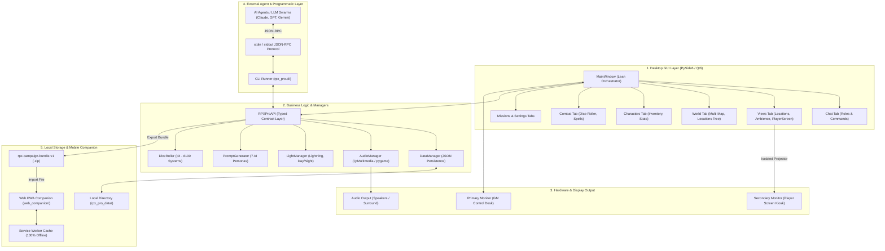
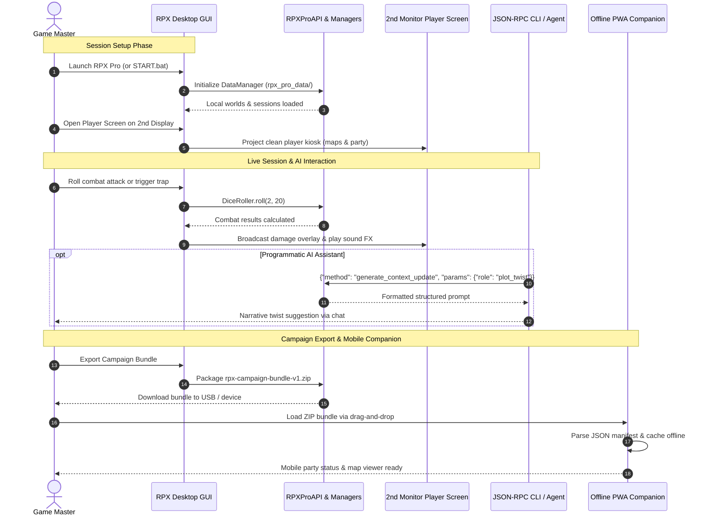

# RPX Pro — RolePlay Xtreme Professional Edition

[English](README.md) | [Deutsch](README_de.md) | [Español](README_es.md) | [简体中文](README_zh.md) | [日本語](README_ja.md) | [Русский](README_ru.md)

> Traducción asistida por máquina; la versión en inglés ([README.md](README.md)) es la autorizada.

[](https://github.com/entertain-and-more/rpx/releases)
[](store_package.json)
[](SECURITY.md)
[](tests/)
[](CONTRIBUTING.md)
[](web_companion/)
[](https://www.qt.io/)
[](https://www.python.org/)
[](https://github.com/entertain-and-more/rpx)
[](#sec-16)
[](SECURITY.md)
[](SECURITY.md)
[-success.svg)](THIRD_PARTY_LICENSES.txt)
[](NOTICE)
[](MARKETING-LOG.txt)
[](MARKETING-LOG.txt)
[](https://github.com/astral-sh/ruff)
[](llms.txt)
[](LICENSE)
[](https://github.com/entertain-and-more)
[](https://github.com/open-bricks)

> Centro de control profesional de juegos de rol para aventuras de mesa de lápiz y papel. Utilizable sin conexión, gratuito y de código abierto.

### Metadatos de la versión

| Campo | Valor |
|-------|-------|
| Versión de la aplicación | `1.0.0` |
| Versión del paquete de la tienda | `1.0.0.0` |
| Estado de la versión | **Sin publicar / Unveröffentlicht** (pendiente de aprobación legal y de la tienda) |
| Editor | Geiger (`CN=52596601-BAB4-4F3F-B182-E8F3F273B202`) |
| Política de privacidad | [PRIVACY_POLICY.md](https://github.com/entertain-and-more/rpx/blob/master/PRIVACY_POLICY.md) |
| Soporte | [GitHub Issues](https://github.com/entertain-and-more/rpx/issues) |
| Revisión de privacidad | `2026-08-10` |

Límite de privacidad: RPX Pro no recopila ni transmite datos automáticamente. Mantiene los datos de la campaña en local; los prompts para una herramienta de IA externa se copian o se muestran localmente y solo salen del dispositivo cuando el usuario decide usar dicha herramienta.

> [!NOTE]
> **Arquitectura Local-First y legible por máquina**: RPX Pro funciona 100 % sin conexión. Todos los datos de campaña, mapas, audio y conjuntos de reglas permanecen en local en `rpx_pro_data/`. Para agentes de IA y flujos de trabajo con LLM externos, RPX Pro ofrece una CLI JSON-RPC sin dependencias (`python -m rpx_pro.app --cli`) sobre `stdin`/`stdout` y exporta archivos ZIP estandarizados `rpx-campaign-bundle-v1` que puede leer el compañero PWA sin conexión de `web_companion/`.

---

## Navegación rápida

1. [Resumen](#sec-01)
2. [Características principales](#sec-02)
3. [Personas objetivo y descubribilidad](#sec-03)
4. [Matriz comparativa frente a alternativas](#sec-04)
5. [Gobernanza e invariantes de ejecución](#sec-05)
6. [Arquitectura visual](#sec-06)
7. [Ciclo de vida de la sesión y flujo de trabajo](#sec-07)
8. [Pantalla del jugador (doble monitor)](#sec-08)
9. [CLI y API para integración con LLM](#sec-09)
10. [Compañero web PWA](#sec-10)
11. [Simulación y mecánicas de juego](#sec-11)
12. [Sistema de conjuntos de reglas y plantillas](#sec-12)
13. [Instalación e inicio rápido](#sec-13)
14. [Desarrollo y suite de pruebas](#sec-14)
15. [Matriz del ecosistema hermano](#sec-15)
16. [Licencias de terceros y gobernanza](#sec-16)
17. [Seguridad y metadatos de la versión](#sec-17)
18. [Licencia y responsabilidad](#sec-18)

---

<a id="sec-01"></a>
<a id="1-overview"></a>
## 1. Resumen

RPX Pro (RolePlay Xtreme Professional Edition) es un centro de control de escritorio completo y de código abierto, diseñado para Directores de Juego (GM / DM) que dirigen juegos de rol de mesa de lápiz y papel. Construido con Python 3.10+ y PySide6 (Qt6), RPX Pro elimina el caos de tener que manejar varias pestañas del navegador, manuales en PDF, suscripciones en la nube y herramientas de mesa de sonido durante las sesiones en directo.

El software funciona bajo un principio arquitectónico local-first sin concesiones: cada mundo de campaña, imagen de mapa, efecto de sonido, hoja de personaje y registro de transacciones se almacena exclusivamente en tu sistema de archivos local en `rpx_pro_data/`. No se necesita ninguna cuenta, no se consulta ningún servidor externo y ninguna nota de campaña sale de tu máquina sin tu orden explícita de exportación.


---

<a id="sec-02"></a>
<a id="2-key-features"></a>
## 2. Características principales

| Característica | Descripción |
|---------|-------------|
| **Sistema de mundos** | Jerarquías de mundos con varios mapas, vistas exteriores e interiores de las ubicaciones, tradición de las naciones, especies y automatización mediante disparadores |
| **Mesa de sonido** | Motor de audio multi-backend (Qt Multimedia, pygame, respaldo winsound) con disparadores por arrastrar y soltar |
| **Efectos de luz** | Destellos de relámpagos dinámicos, efectos estroboscópicos y gradación de color ambiental día/noche (reflejados en la pantalla del jugador) |
| **Motor de combate** | Seguimiento de iniciativa, tiradas de varios dados (d4–d100), cálculo de golpes críticos, mitigación por armadura, armas y conjuros |
| **Pantalla del jugador** | Pantalla dedicada en el 2.º monitor con modos de mosaicos, mapa, rotación e imagen que mantiene en secreto las notas del GM |
| **Importador de conjuntos de reglas** | Plantillas incluidas de D&D 5e (SRD 5.1), DSA 5 (abstraído) y Fantasía genérica, además de importaciones JSON personalizadas |
| **Integración de IA** | Generador de prompts con 7 personas especializadas de rol; prompts copiables sin ninguna transmisión automática a la nube |
| **CLI / API para agentes** | Protocolo CLI JSON-RPC sin dependencias sobre `stdin`/`stdout` para agentes de IA autónomos y automatización sin interfaz |
| **Compañero web PWA** | PWA estática del lado del cliente que lee sin conexión, en dispositivos móviles, archivos ZIP locales `rpx-campaign-bundle-v1` |
| **Gestor de sesiones** | Registro de misiones/encargos, agrupación del grupo, avance de rondas, registro automático de comandos del chat |
| **Gestión de personajes**| Seguimiento detallado de atributos, modal de inventario con límites de peso y oro, vistas previas de avatares, medidores de hambre/sed |
| **Simulación viva** | Relación de progresión del tiempo configurable, tasas de descenso de hambre/sed y eventos aleatorios de catástrofes naturales |

---

<a id="sec-03"></a>
<a id="3-target-personas--discoverability"></a>
<a id="target-personas--discoverability"></a>
## 3. Personas objetivo y descubribilidad

RPX Pro está diseñado para atender los requisitos específicos de cuatro personas de usuario principales en la comunidad de juegos de mesa y de desarrollo:

| ID de persona | Público objetivo | Necesidad principal | Solución arquitectónica clave de RPX Pro |
|---|---|---|---|
| `[PERSONA-01]` | **Directores de Juego (GM / DM) de rol de mesa de lápiz y papel** | Puesto de control local todo en uno para sesiones en directo, con proyección instantánea de mapas, atmósfera dinámica de luz/audio y seguimiento del grupo. | Mesa de sonido integrada, gestor de varios mapas con ubicaciones exteriores/interiores, combate y lanzador de dados, efectos de luz dinámicos y quiosco dedicado para el jugador en el 2.º monitor. |
| `[PERSONA-02]` | **Jugadores preocupados por la privacidad y creadores de tradición homebrew** | Privacidad absoluta de los datos, soberanía local de los datos y resiliencia sin conexión para tradición de mundo, hojas de personaje y campañas propias. | Diseño estricto 100 % sin conexión y sin salida de red (`rpx_pro_data/`), licencia de código abierto MIT y exportaciones ZIP portables `rpx-campaign-bundle-v1`. |
| `[PERSONA-03]` | **Ingenieros de agentes de IA autónomos y creadores de herramientas para LLM** | API programática sin interfaz para orquestar directores de juego de IA, diálogos automáticos de PNJ o la inspección del estado de la campaña. | Protocolo CLI JSON-RPC estandarizado sobre `stdin`/`stdout` (`python -m rpx_pro.app --cli`) que expone métodos tipados sin dependencias de GUI. |
| `[PERSONA-04]` | **Acompañantes móviles de sesión y usuarios de tabletas** | Consultar el inventario de personajes, los espacios de conjuro y los registros de misiones en la mesa de juego física sin configuraciones de servidor complejas ni suscripciones. | Compañero PWA estático sin nube (`web_companion/`) que analiza en el cliente archivos ZIP `rpx-campaign-bundle-v1` con caché de Service Worker sin conexión. |

### Consultas de búsqueda de alta intención

Para facilitar la descubribilidad técnica en directorios de desarrolladores, gestores de paquetes y motores de búsqueda:
- `open source tabletop RPG control center python pyside6` — Estación de trabajo completa sin conexión para directores de juego de lápiz y papel.
- `offline game master tools with second monitor player screen` — Ejecutor de sesiones multipantalla sin costes de suscripción.
- `local-first virtual tabletop companion zero network egress` — Gestor privado de campañas que mantiene la tradición estrictamente en el disco local.
- `json-rpc cli tabletop rpg campaign manager for ai agents` — Backend programático sin interfaz para directores de juego basados en LLM.
- `rpx-campaign-bundle-v1 portable campaign format pwa` — Especificación de paquete de campaña multiplataforma y visor móvil.
- `pyside6 qt6 roleplay xtreme pro ttrpg session manager` — Arquitectura de aplicación de escritorio con señales de Qt6 y modelos de dataclass.
- `dnd 5e dsa generic fantasy offline session manager` — Plantillas de conjuntos de reglas conformes con SRD y personalizables en JSON.
- `multi-backend soundboard and dynamic light effects tabletop rpg` — Integración multimedia atmosférica para sesiones de mesa.

---

<a id="sec-04"></a>
<a id="4-comparative-matrix-vs-alternatives"></a>
<a id="comparative-matrix-vs-alternatives"></a>
## 4. Matriz comparativa frente a alternativas

La siguiente matriz compara RPX Pro con soluciones habituales de mesa virtual y herramientas ad hoc en 10 dimensiones técnicas centrales, directamente asignadas a nuestros invariantes de gobernanza:

| Dimensión técnica | Invariante de gobernanza | RPX Pro | Roll20 (VTT SaaS en la nube) | Foundry VTT (Node.js autoalojado) | Fantasy Grounds (escritorio comercial) | Lápiz y papel ad hoc / herramientas (papel, Obsidian, Syrinscape) |
|:---|:---:|:---:|:---:|:---:|:---:|:---:|
| **1. Offline-First y cero salida de red** | `INV-LOCAL-01` | **100 % sin conexión (disco local en `rpx_pro_data/`, cero telemetría)** | Ninguna (conexión obligatoria a la nube y alojamiento remoto de recursos) | Parcial (requiere un demonio de servidor web local y redirección de puertos) | Parcial (aplicación de escritorio con comprobaciones obligatorias de licencia en la nube) | Alta (papel físico o notas markdown sin conexión) |
| **2. Ejecución sin privilegios** | `INV-USER-02` | **RunAsInvoker estricto (no requiere privilegios de root/administrador)** | Sandbox del navegador | Demonio Node.js (posibles enlaces de puerto y avisos del cortafuegos) | Instalador de Windows que solicita privilegios de administrador | Ediciones manuales de archivos |
| **3. Pantalla de jugador de doble pantalla** | `INV-DUAL-03` | **Segundo monitor nativo (quiosco/mosaicos/rotación con aislamiento del GM)** | Ninguna (requiere una segunda pestaña del navegador con sesión de jugador) | Ninguna (requiere una segunda ventana del navegador con sesión de jugador) | Parcial (segunda instancia conectada por localhost) | Ninguna (pantalla de cartón manual del DM) |
| **4. JSON-RPC sin interfaz para IA** | `INV-RPC-04` | **JSON-RPC stdin/stdout integrado (`python -m rpx_pro.app --cli`)** | Ninguna (interfaz web cerrada, API tras suscripción) | Parcial (macros JavaScript / módulos comunitarios de terceros) | Ninguna (motor Lua propietario sin CLI externa) | Ninguna (puramente manual) |
| **5. Paquetes de campaña deterministas** | `INV-BUNDLE-05` | **Especificación ZIP estandarizada `rpx-campaign-bundle-v1`** | Ninguna (campañas atadas a la nube, sin exportación de paquete en bruto) | Parcial (carpetas de mundo complejas con archivos de base de datos) | Archivos de campaña propietarios `.mod` / `.xml` | Carpetas sueltas sin estructura con documentos e imágenes |
| **6. Compañero PWA estático sin conexión** | `INV-PWA-06` | **PWA sin nube (`web_companion/`) con Service Worker** | Aplicación móvil cerrada que requiere cuenta en la nube | Ninguna (el acceso desde navegador móvil requiere un servidor en ejecución) | Ninguna (solo escritorio) | Aplicaciones de notas de terceros / lectores de PDF |
| **7. Licencia y modelo de precios** | `INV-COPYLEFT-07` | **100 % gratuito y de código abierto (licencia MIT, sin suscripciones)** | Freemium con suscripciones mensuales recurrentes (5–10 $/mes) | Compra única comercial (licencia de 50 $) | Software comercial (39–149 $ + compra de conjuntos de reglas) | Variable (libros físicos y papelería) |
| **8. Integración de IA con protección de la privacidad** | `INV-LLM-08` | **7 roles de IA estructurados sin transmisión automática** | Ninguna / betas de IA en la nube cerradas | Plugins de API de terceros (requieren clave de API externa) | Ninguna | Copiar y pegar manualmente en LLM web |
| **9. Audio y luces atmosféricos** | `INV-ECO-09` | **Mesa de sonido integrada (Qt/pygame) + efectos de relámpago/estroboscopio/día-noche** | Jukebox web básico (almacenamiento limitado) | Listas de reproducción de audio ambiental basadas en módulos | Enlaces de sonido mediante la integración externa de Syrinscape | Altavoces Bluetooth externos / aplicaciones separadas |
| **10. SLA de seguridad y CI multi-SO** | `INV-SLA-10` | **SLA de 48 h / triaje en 5 d + CI de GitHub Actions (Ubuntu/macOS/Windows)** | Cola de tickets de clientes de la plataforma SaaS | Discord comunitario / soporte del proveedor | Foro de soporte propietario del proveedor | Ninguna (herramientas personales sin mantenimiento) |

---

<a id="sec-05"></a>
<a id="5-governance--runtime-invariants"></a>
<a id="governance--runtime-invariants"></a>
## 5. Gobernanza e invariantes de ejecución

RPX Pro aplica diez invariantes formales de gobernanza y de ejecución a lo largo de su arquitectura:

| ID de invariante | Nombre canónico | Mecanismo de verificación | Regla arquitectónica |
|---|---|---|---|
| `INV-LOCAL-01` | **100 % sin conexión y local-first con cero salida de red** | Aislamiento en ejecución y contrato de pruebas | Todos los datos de mundo, sesión y personaje permanecen en `rpx_pro_data/`. Sin llamadas remotas "phone-home" ni analítica. |
| `INV-USER-02` | **Modo de usuario sin privilegios y sin elevación** | Modelo de seguridad de procesos | Funciona estrictamente bajo `RunAsInvoker`; no se requiere elevación de administrador para la ejecución estándar. |
| `INV-DUAL-03` | **Aislamiento y reflejo del estado de doble pantalla** | Enrutador de pantalla basado en señales | La preparación del GM, las estadísticas ocultas de monstruos y la niebla de mapa sin revelar nunca se proyectan en la vista del jugador del 2.º monitor. |
| `INV-RPC-04` | **Interfaz CLI JSON-RPC sin interfaz gráfica** | Suite de contratos stdio | Expone un protocolo JSON-RPC programático `stdin`/`stdout` (`rpx_pro.cli`) para la operación por agentes y CLI. |
| `INV-BUNDLE-05` | **Exportación determinista de paquetes de campaña** | Esquema ZIP con sumas de verificación (`v1`) | Exportación completa de mundos, sesiones y conjuntos de reglas al formato portable `rpx-campaign-bundle-v1`. |
| `INV-PWA-06` | **Compañero PWA del lado del cliente sin nube** | Suite de pruebas del Service Worker | El compañero Web/PWA estático funciona 100 % en el navegador con caché sin conexión y cero peticiones al servidor. |
| `INV-COPYLEFT-07` | **Licencia permisiva y enlazado dinámico** | Auditoría de licencias SPDX | Núcleo MIT; PySide6 (LGPL-3.0) y pygame (LGPL-2.1) se enlazan dinámicamente conforme al §4 de LGPLv3. |
| `INV-LLM-08` | **Generación de prompts de IA con protección de la privacidad** | Pruebas unitarias del generador de prompts | 7 personas de IA generan texto de prompt copiable en local; sin transmisión automática a APIs de LLM en la nube. |
| `INV-ECO-09` | **Interoperabilidad modular del ecosistema hermano** | Pruebas de la matriz del ecosistema | Plena interoperabilidad con las herramientas hermanas de `entertain-and-more` y `open-bricks` (p. ej., KlangpultLight). |
| `INV-SLA-10` | **SLA contractual de seguridad y CI multiplataforma** | CI de GitHub Actions multi-SO | Compromiso de respuesta en 48 h / triaje en 5 d con CI continua en Ubuntu, macOS y Windows. |

---

<a id="sec-06"></a>
<a id="6-visual-architecture"></a>
<a id="visual-architecture"></a>
## 6. Arquitectura visual

### Proyección topológica arquitectónica en cuatro vistas

```text
+---------------------------------------------------------------------------------------------------+
|               VIEW 1: CLIENT RUNTIMES, USER INTERFACES & AUTOMATION ENTRY POINTS                  |
|  - Desktop PySide6 / Qt6 Multi-Tab Workspace (Main Control Desk, Chat, Combat, Maps, Sound)        |
|  - Headless JSON-RPC CLI Runner (`python -m rpx_pro.app --cli`) over Stdio for Autonomous Agents  |
|  - Dual-Monitor Player Display Projection Kiosk (Fog-of-War, Ambient Mirrors, Hidden GM Notes)   |
|  - Zero-Cloud Mobile Web Companion PWA (`web_companion/`) with Service Worker Offline Storage     |
+---------------------------------------------------------------------------------------------------+
                                                  |
                                                  v
+---------------------------------------------------------------------------------------------------+
|                VIEW 2: RPX PRO SOVEREIGN CORE ENGINE & ORCHESTRATION PIPELINE                     |
|  - RPXProAPI Sovereign Contract Layer: Thread-Safe State Dispatcher & Event Notification Bus     |
|  - Multi-Backend Audio Engine (Qt Multimedia -> pygame -> winsound Graceful Degradation)         |
|  - Dynamic Light & Atmosphere Driver (Procedural Lightning, Strobe FX, Day/Night Color Shifts)    |
|  - Deterministic Dice Engine (Polyhedral d4..d100, Exploding Rolls, Criticals, Armor Mitigation)  |
|  - Rule Template Engine (D&D 5e SRD 5.1, DSA 5, Generic Fantasy & Custom Extensible JSON Rules)   |
|  - Privacy-Guarded AI Prompt Orchestrator (7 Specialized Personas, Local Staging Buffer)         |
+---------------------------------------------------------------------------------------------------+
                                                  |
                                                  v
+---------------------------------------------------------------------------------------------------+
|                  VIEW 3: RUNTIME PERSISTENCE, CAMPAIGN BUNDLES & LOCAL VAULT                      |
|  - Local File System Campaign Storage (`rpx_pro_data/`) in Structured JSON Data Schemas           |
|  - Standardized Portable Campaign Export: `rpx-campaign-bundle-v1` Checksummed ZIP Archive       |
|  - Audio Assets & Multi-Resolution Cartographic Tile Cache (`assets/`, `audio/`, `maps/`)         |
|  - Session Journal WAL & Audit Log (Party Trajectories, Round Sequences, In-Game Chat History)   |
+---------------------------------------------------------------------------------------------------+
                                                  |
                                                  v
+---------------------------------------------------------------------------------------------------+
|               VIEW 4: AIR-GAP DEFENSE PERIMETER, RUNASINVOKER & GOVERNANCE                        |
|  - 100% Offline-First Architecture & Zero Network Egress (`INV-LOCAL-01`): Zero Outbound Sockets|
|  - Unprivileged Execution Security Model (`INV-USER-02`): Strict `RunAsInvoker`, Non-Elevated     |
|  - Permissive Licensing & LGPL Dynamic Linking Isolation (`INV-COPYLEFT-07`): MIT Core Boundary   |
|  - Verified Governance & Runtime Invariants (`INV-LOCAL-01` through `INV-SLA-10`) Compliance      |
|  - Formal § 521 BGB Statutory Liability Disclaimer & Contractual 48h Security Response SLA       |
+---------------------------------------------------------------------------------------------------+
```

### Flujo de componentes y orquestación de señales



---

<a id="sec-07"></a>
<a id="7-session-lifecycle--workflow"></a>
## 7. Ciclo de vida de la sesión y flujo de trabajo



---

<a id="sec-08"></a>
<a id="8-player-screen-dual-monitor"></a>
## 8. Pantalla del jugador (doble monitor)

La Pantalla del jugador es una pantalla dedicada en un monitor secundario, pensada para orientarse hacia los jugadores en la mesa o para emitirse mediante una webcam virtual:
- **4 modos de visualización**:
  - *Imagen*: ilustraciones de ubicaciones a pantalla completa, retratos de PNJ o ilustraciones de objetos.
  - *Mapa*: mapa interactivo del mundo o de la mazmorra con desplazamiento, zoom y marcadores revelados a los jugadores.
  - *Rotación*: recorre automáticamente los mosaicos activos con un temporizador configurable.
  - *Mosaicos*: panel de varias secciones que muestra el estado del grupo de personajes, el registro de misiones y la escena actual.
- **Conmutadores de vista dinámicos**: casillas de verificación permiten al GM activar o desactivar sobre la marcha las barras de PV del grupo, las misiones activas, el registro del chat, el orden de turnos, las ilustraciones de ubicaciones y el inventario.
- **Reflejo atmosférico**: los destellos de relámpagos ambientales, la gradación de color día/noche y los efectos estroboscópicos del entorno se reflejan al instante desde el puesto del GM.
- **Límite completo de información**: las notas del GM, las fichas de estadísticas de monstruos, la preparación de encuentros y las ubicaciones sin revelar están estrictamente aisladas y nunca se muestran en la pantalla del jugador.

---

<a id="sec-09"></a>
<a id="9-cli--api-for-llm-integration"></a>
## 9. CLI y API para integración con LLM

RPX Pro ofrece un protocolo JSON-RPC sin dependencias sobre la entrada/salida estándar para pruebas automatizadas e integración con agentes:

```bash
python -m rpx_pro.app --cli
```

### Ejemplo de protocolo

```json
{"id": 1, "method": "roll_dice", "params": {"count": 2, "sides": 20}}
{"id": 1, "result": {"dice": "2d20", "rolls": [14, 7], "total": 21}}
```

### Métodos disponibles
- **Mundos y sesiones**: `create_world`, `list_worlds`, `load_world`, `create_session`, `list_sessions`, `load_session`
- **Grupo y combate**: `create_character`, `get_character`, `heal_character`, `damage_character`, `get_inventory`, `give_item`, `roll_dice`
- **Chat y registro**: `send_chat_message`, `get_chat_history`, `create_mission`, `complete_mission`
- **Personas de IA**: `generate_start_prompt`, `generate_context_update`
- **Paquetes portables**: `export_campaign_bundle`, `import_campaign_bundle`

---

<a id="sec-10"></a>
<a id="10-web-companion-pwa"></a>
## 10. Compañero web PWA

El compañero Web/PWA estático (`web_companion/`) ofrece una interfaz móvil para tabletas y teléfonos sin necesidad de un demonio de servidor:
- **Sin nube y 100 % del lado del cliente**: funciona por completo en el navegador usando HTML5, CSS3 y JavaScript moderno.
- **Caché sin conexión mediante Service Worker**: una vez cargado, el armazón se almacena en caché localmente; las visitas posteriores se cargan sin ninguna conectividad de red.
- **Restauración de paquetes**: recuerda y restaura el último archivo ZIP `rpx-campaign-bundle-v1` cargado entre reinicios del móvil.
- **Diseño con áreas seguras**: adaptado a pantallas iOS y Android con controles táctiles adaptables.

Vista previa local:
```bash
cd web_companion
python -m http.server 8765
```

---

<a id="sec-11"></a>
<a id="11-simulation--game-mechanics"></a>
## 11. Simulación y mecánicas de juego

- **Progresión de hambre y sed**: simulación en tiempo real calculada en proporción al tiempo de juego. Genera avisos en los umbrales del 50 % y el 75 % con multiplicadores de raza configurables.
- **Relaciones de tiempo dinámicas**: el tiempo de juego transcurre proporcionalmente al tiempo real de la sesión, activando superposiciones visuales de día/noche y anuncios de avance de día.
- **Catástrofes naturales**: eventos ambientales configurables (terremotos, riadas repentinas, tormentas, erupciones volcánicas) acompañados de destellos estroboscópicos visuales y registros en el chat.

---

<a id="sec-12"></a>
<a id="12-ruleset-system--templates"></a>
## 12. Sistema de conjuntos de reglas y plantillas

RPX Pro incluye tres plantillas genéricas de licencia abierta:
1. **D&D 5e (SRD 5.1)** — 9 razas estándar, 19 armas, 12 conjuntos de armadura, 14 conjuros básicos.
2. **DSA 5 (abstraído)** — 12 pueblos, 15 armas, 7 clasificaciones de armadura, 12 conjuros.
3. **Fantasía genérica** — 5 arquetipos de fantasía, 10 armas, 5 conjuntos de armadura, 10 conjuros elementales.

Se pueden crear conjuntos de reglas personalizados en JSON e importarlos mediante `File > Import Ruleset`.

---

<a id="sec-13"></a>
<a id="13-installation--quickstart"></a>
## 13. Instalación e inicio rápido

```bash
# Clone repository
git clone https://github.com/entertain-and-more/rpx.git
cd rpx

# Install dependencies
pip install -r requirements.txt

# Launch GUI
python RPX_Pro_1.py
# or:
python -m rpx_pro.app
```

En Windows, basta con hacer doble clic en `START.bat`.

### Guía de inicio rápido
1. **Crear un mundo**: ve a la pestaña *World* > haz clic en *New World* > introduce el nombre de un reino.
2. **Asignar un mapa**: haz clic en *Load Map...* y selecciona cualquier archivo de imagen (PNG/JPG/SVG).
3. **Añadir ubicaciones**: haz clic en *Add Location* para definir ciudades, castillos o mazmorras con vistas exteriores/interiores.
4. **Crear una sesión**: selecciona *File > New Session* y vincula tu mundo.
5. **Añadir personajes**: en la pestaña *Characters*, crea miembros del grupo y PNJ.
6. **Iniciar la pantalla del jugador**: en *Views > Player Screen*, abre la pantalla del 2.º monitor para tus jugadores.

---

<a id="sec-14"></a>
<a id="14-development--test-suite"></a>
## 14. Desarrollo y suite de pruebas

```bash
# Run Python contract and unit test suite
pytest

# Verify platform source smoke
pytest tests/test_source_platform_smoke.py

# Verify release metadata alignment
python _scripts/verify_release_metadata.py

# Run Web Companion PWA test suite
node --test web_companion/tests/*.mjs

# Code quality and linter checks
ruff check .
python -m compileall -q RPX_Pro_1.py rpx_pro tests
```

---

<a id="sec-15"></a>
<a id="15-sibling-ecosystem-matrix"></a>
<a id="sibling-ecosystem-matrix"></a>
## 15. Matriz del ecosistema hermano

RPX Pro actúa como ancla de la estación de trabajo de entretenimiento y juegos de mesa dentro del ecosistema `entertain-and-more` y `open-bricks`:

| Repositorio | Alcance / Propósito | Sinergia con RPX Pro |
|---|---|---|
| [`entertain-and-more/rpx`](https://github.com/entertain-and-more/rpx) | Centro de control de sesiones de JdR de mesa y estación de trabajo del GM | Aplicación anfitriona principal |
| [`entertain-and-more/KlangpultLight`](https://github.com/entertain-and-more/KlangpultLight) | Mesa de sonido ligera y compañero de audio para la puesta en escena | Compañero especializado para efectos de sonido en directo independientes |
| [`file-bricks/SoftwareCenter`](https://github.com/file-bricks/SoftwareCenter) | Lanzador de software de escritorio y herramientas portables | Centro de distribución y lanzamiento con un clic para RPX Pro |
| [`ellmos-ai/ellmos-filecommander-mcp`](https://github.com/ellmos-ai/ellmos-filecommander-mcp) | Servidor MCP del sistema de archivos local (borrado seguro, búsqueda, OCR, ZIP) | Gestión de recursos de campaña y de la biblioteca de sonidos para agentes de IA |
| [`ellmos-ai/ellmos-homebase-mcp`](https://github.com/ellmos-ai/ellmos-homebase-mcp) | MCP de memoria local-first y conocimiento de campaña | Backend de memoria de campaña para agentes de IA |
| [`ellmos-ai/open-compute`](https://github.com/ellmos-ai/open-compute) | Motor de automatización de escritorio e interacción con el mundo del SO | Orquestación autónoma de flujos de trabajo a nivel de SO |
| [`open-bricks`](https://github.com/open-bricks) | Ecosistema paraguas de herramientas modulares local-first | Estándares arquitectónicos globales de código abierto |

---

<a id="sec-16"></a>
<a id="16-third-party-licenses--governance"></a>
<a id="third-party-licenses--governance"></a>
## 16. Licencias de terceros y gobernanza

RPX Pro se compromete con una transparencia total en materia de licencias:
- **Licencia del núcleo**: [MIT License](LICENSE).
- **PySide6 (Qt6)**: LGPL-3.0 mediante enlazado dinámico oficial, en pleno cumplimiento de la **sección 4 de LGPLv3**. Sin modificaciones en las bibliotecas fuente de Qt.
- **pygame**: LGPL-2.1, respaldo de audio con enlazado dinámico.
- **Biblioteca estándar de Python**: PSFL-2.0.
- **Aviso canónico**: [NOTICE](NOTICE).
- **Inventario completo de licencias y SBOM de nivel 1**: consulta [THIRD_PARTY_LICENSES.md](THIRD_PARTY_LICENSES.md) y [THIRD_PARTY_LICENSES.txt](THIRD_PARTY_LICENSES.txt).

---

<a id="sec-17"></a>
<a id="17-security--release-metadata"></a>
<a id="security--release-metadata"></a>
## 17. Seguridad y metadatos de la versión

- **SLA de respuesta de seguridad**: acuse de recibo contractual en 48 horas y compromiso de triaje en 5 días (consulta [SECURITY.md](SECURITY.md)).
- **Ejecución sin privilegios**: diseñado para la ejecución como usuario estándar (`RunAsInvoker`).
- **Estado de la versión**: actualmente **Sin publicar / Unveröffentlicht**, a la espera de la aprobación final de la tienda y del empaquetado.

---

<a id="sec-18"></a>
<a id="18-license--liability"></a>
<a id="license--liability"></a>
## 18. Licencia y responsabilidad

### Licencia de código abierto y atribución
RPX Pro es software libre y de código abierto bajo la **[MIT License](LICENSE)**.
Aviso canónico de copyright y atribución del proyecto: consulta **[NOTICE](NOTICE)**.

```
RPX Pro (RolePlay Xtreme Professional Edition)
Copyright (c) 2026 Lukas Geiger
Developed as part of the entertain-and-more gaming organization (https://github.com/entertain-and-more)
and the open-bricks open-source software ecosystem (https://github.com/open-bricks).
```

### Exención de responsabilidad legal (§ 521 BGB Gefälligkeitsrecht)
Este proyecto es una contribución de código abierto voluntaria y no remunerada, ofrecida de forma gratuita ("unentgeltliche Schenkung"). Conforme a la legislación alemana (§ 521 BGB), la responsabilidad del autor se limita estrictamente al dolo y a la negligencia grave. Úsalo bajo tu propia responsabilidad. No se asume ninguna garantía, garantía de mantenimiento ni idoneidad para un fin determinado. También se aplican los términos de la licencia MIT.

> **Gesetzlicher Haftungsausschluss (§ 521 BGB):**
> Dieses Projekt ist eine unentgeltliche Open-Source-Schenkung im Sinne der §§ 516 ff. BGB. Die Haftung des Autors ist gemäß **§ 521 BGB** auf **Vorsatz und grobe Fahrlässigkeit** beschränkt. Ergänzend gilt der Haftungsausschluss der MIT-Lizenz.
>
> *Resumen en español:* Este proyecto es una donación de código abierto no remunerada en el sentido de los §§ 516 y ss. del BGB (Código Civil alemán). Conforme al **§ 521 BGB**, la responsabilidad del autor se limita al **dolo y la negligencia grave**. Además, se aplica la exención de responsabilidad de la licencia MIT.

### SLA vinculante de respuesta de seguridad de 48 horas
Nos comprometemos con un proceso estructurado y responsable de gestión de vulnerabilidades de seguridad:

| Compromiso del SLA | Objetivo de respuesta | Descripción |
|---|---|---|
| **Acuse de recibo inicial** | **≤ 48 horas** | Confirmación formal de la recepción del informe de seguridad |
| **Triaje técnico** | **≤ 5 días hábiles** | Valoración de la gravedad, comprobación de reproducibilidad y plan de corrección |
| **Actualizaciones de progreso** | **Cada 7 días hábiles** | Comunicación continua y transparente del estado hasta la publicación del parche |
| **Canales de notificación** | Confidencial | `security@open-bricks.org`, `security@ellmos.ai`, `support@lukasgeiger.com` o GitHub Private Security Advisory |
