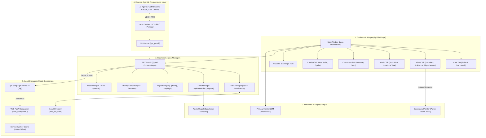
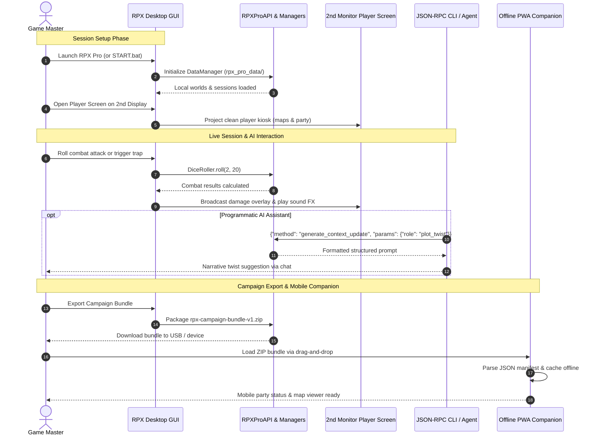

# RPX Pro — RolePlay Xtreme Professional Edition

[English](README.md) | [Deutsch](README_de.md) | [Español](README_es.md) | [简体中文](README_zh.md) | [日本語](README_ja.md) | [Русский](README_ru.md)

> 本書は機械支援翻訳です。英語版([README.md](README.md))が正本です。

[](https://github.com/entertain-and-more/rpx/releases)
[](store_package.json)
[](SECURITY.md)
[](tests/)
[](CONTRIBUTING.md)
[](web_companion/)
[](https://www.qt.io/)
[](https://www.python.org/)
[](https://github.com/entertain-and-more/rpx)
[](#sec-16)
[](SECURITY.md)
[](SECURITY.md)
[-success.svg)](THIRD_PARTY_LICENSES.txt)
[](NOTICE)
[](MARKETING-LOG.txt)
[](MARKETING-LOG.txt)
[](https://github.com/astral-sh/ruff)
[](llms.txt)
[](LICENSE)
[](https://github.com/entertain-and-more)
[](https://github.com/open-bricks)

> テーブルトップ・ペン&ペーパー・アドベンチャーのための、プロフェッショナルなロールプレイングゲーム・コントロールセンター。オフライン対応、無料、オープンソース。

### リリースメタデータ

| 項目 | 値 |
|-------|-------|
| アプリケーションバージョン | `1.0.0` |
| ストアパッケージバージョン | `1.0.0.0` |
| リリースステータス | **未リリース / Unveröffentlicht**(法務確認およびストア承認待ち) |
| 発行者 | Geiger (`CN=52596601-BAB4-4F3F-B182-E8F3F273B202`) |
| プライバシーポリシー | [PRIVACY_POLICY.md](https://github.com/entertain-and-more/rpx/blob/master/PRIVACY_POLICY.md) |
| サポート | [GitHub Issues](https://github.com/entertain-and-more/rpx/issues) |
| プライバシーレビュー | `2026-08-10` |

プライバシー境界:RPX Pro はデータの自動収集・送信を一切行いません。キャンペーンデータはローカルに保持され、外部 AI ツール向けのプロンプトはローカルでコピーまたは表示されるだけで、ユーザーがそのツールの使用を選択した場合にのみ端末の外へ出ます。

> [!NOTE]
> **ローカルファースト&機械可読アーキテクチャ**:RPX Pro は 100% オフラインで動作します。すべてのキャンペーンデータ、マップ、オーディオ、ルールセットは `rpx_pro_data/` 内にローカル保存されます。AI エージェントや外部 LLM ワークフロー向けに、RPX Pro は `stdin`/`stdout` 経由の依存関係ゼロの JSON-RPC CLI(`python -m rpx_pro.app --cli`)を提供し、`web_companion/` にあるオフライン PWA コンパニオンで読み取り可能な標準化された `rpx-campaign-bundle-v1` ZIP ファイルをエクスポートします。

---

## クイックナビゲーション

1. [概要](#sec-01)
2. [主な機能](#sec-02)
3. [ターゲットペルソナと発見性](#sec-03)
4. [代替製品との比較マトリクス](#sec-04)
5. [ガバナンスと実行時不変条件](#sec-05)
6. [ビジュアルアーキテクチャ](#sec-06)
7. [セッションのライフサイクルとワークフロー](#sec-07)
8. [プレイヤー画面(デュアルモニター)](#sec-08)
9. [LLM 連携のための CLI と API](#sec-09)
10. [Web コンパニオン PWA](#sec-10)
11. [シミュレーションとゲームメカニクス](#sec-11)
12. [ルールセットシステムとテンプレート](#sec-12)
13. [インストールとクイックスタート](#sec-13)
14. [開発とテストスイート](#sec-14)
15. [姉妹エコシステムマトリクス](#sec-15)
16. [サードパーティライセンスとガバナンス](#sec-16)
17. [セキュリティとリリースメタデータ](#sec-17)
18. [ライセンスと責任](#sec-18)

---

<a id="sec-01"></a>
<a id="1-overview"></a>
## 1. 概要

RPX Pro(RolePlay Xtreme Professional Edition)は、テーブルトップ・ペン&ペーパー RPG を進行するゲームマスター(GM / DM)のために設計された、包括的なオープンソースのデスクトップ・コントロールセンターです。Python 3.10+ と PySide6(Qt6)で構築されており、ライブセッション中に複数のブラウザタブ、PDF ルールブック、クラウドサブスクリプション、サウンドボードツールを使い分ける煩雑さを解消します。

このソフトウェアは、妥協のないローカルファースト・アーキテクチャの原則に基づいて動作します。すべてのキャンペーンワールド、マップ画像、効果音、キャラクターのステータスシート、トランザクションログは、ローカルファイルシステムの `rpx_pro_data/` にのみ保存されます。アカウントは不要で、外部サーバーへの問い合わせも行われず、ユーザーが明示的にエクスポートを実行しない限り、キャンペーンのノートがマシンの外へ出ることはありません。


---

<a id="sec-02"></a>
<a id="2-key-features"></a>
## 2. 主な機能

| 機能 | 説明 |
|---------|-------------|
| **ワールドシステム** | 多層マップのワールド階層、屋外・屋内ロケーションビュー、国家設定、種族、トリガー自動化 |
| **サウンドボード** | マルチバックエンドのオーディオエンジン(Qt Multimedia、pygame、winsound フォールバック)、ドラッグ&ドロップによるトリガー |
| **ライトエフェクト** | ダイナミックな稲妻の閃光、ストロボ効果、昼夜の環境カラーグレーディング(プレイヤーディスプレイにミラーリング) |
| **戦闘エンジン** | イニシアチブ管理、複数ダイスのロール(d4〜d100)、クリティカルヒット計算、防具による軽減、武器と呪文 |
| **プレイヤー画面** | GM のメモを秘匿したまま、タイル・マップ・ローテーション・画像の各モードを備えた専用の 2 台目モニター表示 |
| **ルールセットインポーター** | D&D 5e(SRD 5.1)、DSA 5(抽象化版)、汎用ファンタジーのテンプレートを同梱し、カスタム JSON のインポートにも対応 |
| **AI 連携** | 7 つの専門 RPG ペルソナを備えたプロンプトジェネレーター。コピー可能なプロンプトで、クラウドへの自動送信は一切なし |
| **エージェント向け CLI / API** | 自律型 AI エージェントやヘッドレス自動化のための、`stdin`/`stdout` 経由の依存関係ゼロの JSON-RPC CLI プロトコル |
| **PWA Web コンパニオン** | ローカルの `rpx-campaign-bundle-v1` ZIP アーカイブをモバイル端末でオフライン読み取りする、静的なクライアントサイド PWA |
| **セッションマネージャー** | クエスト/ミッションの記録、パーティのグループ化、ラウンド進行、チャットコマンドの自動ログ記録 |
| **キャラクター管理**| 詳細な能力値管理、重量とゴールドの上限付きインベントリモーダル、アバタープレビュー、空腹/渇きメーター |
| **リビングシミュレーション** | 設定可能な時間進行比率、空腹/渇きの減衰率、ランダムな自然災害イベント |

---

<a id="sec-03"></a>
<a id="3-target-personas--discoverability"></a>
<a id="target-personas--discoverability"></a>
## 3. ターゲットペルソナと発見性

RPX Pro は、テーブルトップゲームおよび開発コミュニティにおける 4 つの主要ユーザーペルソナの具体的な要件に応えるよう設計されています。

| ペルソナ ID | 対象ユーザー | 主なニーズ | RPX Pro の主要なアーキテクチャ上の解決策 |
|---|---|---|---|
| `[PERSONA-01]` | **テーブルトップ・ペン&ペーパーのゲームマスター(GM / DM)** | 即時のマップ投影、ダイナミックな照明/音響の演出、パーティ管理を備えた、ライブセッション用のオールインワン・ローカル操作卓。 | 内蔵サウンドボード、屋外/屋内ロケーション付きマルチマップマネージャー、戦闘・ダイスローラー、ダイナミックなライトエフェクト、専用の 2 台目モニター用プレイヤーキオスク。 |
| `[PERSONA-02]` | **プライバシーを重視するプレイヤーとホームブリュー設定の制作者** | 独自のワールド設定、キャラクターシート、キャンペーンに対する絶対的なデータプライバシー、ローカルでのデータ主権、オフラインでの耐障害性。 | 厳格な 100% オフライン、ネットワーク送信ゼロの設計(`rpx_pro_data/`)、MIT オープンソースライセンス、ポータブルな `rpx-campaign-bundle-v1` ZIP エクスポート。 |
| `[PERSONA-03]` | **自律型 AI エージェントのエンジニアと LLM ツール開発者** | AI ダンジョンマスター、自動 NPC 対話、キャンペーン状態の検査を制御するための、プログラムから利用できるヘッドレス API。 | GUI 依存ゼロで型付きメソッドを公開する、`stdin`/`stdout` 経由の標準化された JSON-RPC CLI プロトコル(`python -m rpx_pro.app --cli`)。 |
| `[PERSONA-04]` | **モバイルセッションコンパニオンとタブレットユーザー** | 複雑なサーバー構築やサブスクリプションなしで、実際のゲームテーブルでキャラクターのインベントリ、呪文スロット、クエストログを確認する。 | `rpx-campaign-bundle-v1` ZIP ファイルをクライアント側で解析し、Service Worker によるオフラインキャッシュを備えた、クラウド不要の静的 PWA コンパニオン(`web_companion/`)。 |

### 高意図の検索クエリ

開発者ディレクトリ、パッケージマネージャー、検索エンジンでの技術的な発見性を高めるため:
- `open source tabletop RPG control center python pyside6` — ペン&ペーパーのゲームマスター向けの完全オフライン・ワークステーション。
- `offline game master tools with second monitor player screen` — サブスクリプション費用のかからない、マルチディスプレイ対応のセッションランナー。
- `local-first virtual tabletop companion zero network egress` — ワールド設定をローカルディスク内に厳格に留める、プライベートなキャンペーンマネージャー。
- `json-rpc cli tabletop rpg campaign manager for ai agents` — LLM ダンジョンマスター向けのヘッドレスなプログラマブル・バックエンド。
- `rpx-campaign-bundle-v1 portable campaign format pwa` — クロスプラットフォームのキャンペーンバンドル仕様とモバイルビューア。
- `pyside6 qt6 roleplay xtreme pro ttrpg session manager` — Qt6 のシグナルとデータクラスモデルを特徴とするデスクトップアプリケーション・アーキテクチャ。
- `dnd 5e dsa generic fantasy offline session manager` — JSON でカスタマイズ可能な、SRD 準拠のルールセットテンプレート。
- `multi-backend soundboard and dynamic light effects tabletop rpg` — テーブルトップセッションのための雰囲気づくりを担うマルチメディア統合。

---

<a id="sec-04"></a>
<a id="4-comparative-matrix-vs-alternatives"></a>
<a id="comparative-matrix-vs-alternatives"></a>
## 4. 代替製品との比較マトリクス

次のマトリクスは、RPX Pro を一般的なバーチャルテーブルトップ製品や場当たり的なツールと、ガバナンス不変条件に直接対応づけた 10 の中核的な技術観点で比較したものです。

| 技術的観点 | ガバナンス不変条件 | RPX Pro | Roll20(クラウド SaaS VTT) | Foundry VTT(セルフホスト Node.js) | Fantasy Grounds(商用デスクトップ) | 場当たり的なペン&ペーパー/ツール(紙、Obsidian、Syrinscape) |
|:---|:---:|:---:|:---:|:---:|:---:|:---:|
| **1. オフラインファースト&送信ゼロ** | `INV-LOCAL-01` | **100% オフライン(`rpx_pro_data/` 内のローカルディスク、テレメトリなし)** | なし(クラウド接続とリモートでのアセットホスティングが必須) | 部分的(ローカル Web サーバーデーモンとポートフォワーディングが必要) | 部分的(クラウドでのライセンス確認が必須のデスクトップアプリ) | 高い(紙、またはオフラインの Markdown ノート) |
| **2. 非特権での実行** | `INV-USER-02` | **厳格な RunAsInvoker(root/管理者権限は不要)** | ブラウザサンドボックス | Node.js デーモン(ポートバインドやファイアウォールのプロンプトが発生しうる) | 管理者権限を要求する Windows インストーラー | 手作業でのファイル編集 |
| **3. デュアルスクリーンのプレイヤー表示** | `INV-DUAL-03` | **ネイティブな 2 台目モニター(GM 情報を分離したキオスク/タイル/ローテーション)** | なし(プレイヤーとしてログインした 2 つ目のブラウザタブが必要) | なし(プレイヤーとしてログインした 2 つ目のブラウザウィンドウが必要) | 部分的(localhost 経由で接続する 2 つ目のインスタンス) | なし(手作りの厚紙製 DM スクリーン) |
| **4. AI 向けヘッドレス JSON-RPC** | `INV-RPC-04` | **内蔵の stdin/stdout JSON-RPC(`python -m rpx_pro.app --cli`)** | なし(クローズドな Web インターフェース、API はサブスクリプション限定) | 部分的(JavaScript マクロ/サードパーティのコミュニティモジュール) | なし(外部 CLI のない独自 Lua エンジン) | なし(完全に手作業) |
| **5. 決定論的なキャンペーンバンドル** | `INV-BUNDLE-05` | **標準化された `rpx-campaign-bundle-v1` ZIP 仕様** | なし(クラウドに閉じたキャンペーン、生のバンドルエクスポートなし) | 部分的(データベースファイルを含む複雑なワールドフォルダ) | 独自形式の `.mod` / `.xml` キャンペーンアーカイブ | ドキュメントや画像が無秩序に入ったフォルダ |
| **6. 静的オフライン PWA コンパニオン** | `INV-PWA-06` | **Service Worker 付きのクラウド不要 PWA(`web_companion/`)** | クラウドアカウントが必要なクローズドなモバイルアプリ | なし(モバイルブラウザからのアクセスにはサーバーの稼働が必要) | なし(デスクトップのみ) | サードパーティのノートアプリ/PDF リーダー |
| **7. ライセンスと価格モデル** | `INV-COPYLEFT-07` | **100% 無料のオープンソース(MIT ライセンス、サブスクリプションなし)** | 月額課金のフリーミアム(月 $5〜$10) | 商用の買い切り($50 のライセンス料) | 商用ソフトウェア($39〜$149 + ルールセットの購入) | 場合による(紙の書籍や文房具) |
| **8. プライバシーを守る AI 連携** | `INV-LLM-08` | **自動送信ゼロの 7 つの構造化 AI ロール** | なし/クローズドなクラウド AI ベータ | サードパーティ API プラグイン(外部 API キーが必要) | なし | Web 版 LLM への手動コピー&ペースト |
| **9. 雰囲気づくりのための音響と照明** | `INV-ECO-09` | **統合サウンドボード(Qt/pygame)+ 稲妻/ストロボ/昼夜エフェクト** | 基本的な Web ジュークボックス(ストレージ制限あり) | モジュールベースの環境音プレイリスト | 外部の Syrinscape 連携によるサウンドリンク | 外付け Bluetooth スピーカー/別のアプリ |
| **10. セキュリティ SLA とマルチ OS の CI** | `INV-SLA-10` | **48 時間 SLA / 5 日トリアージ + GitHub Actions CI(Ubuntu/macOS/Windows)** | SaaS プラットフォームのカスタマーチケットキュー | コミュニティ Discord/ベンダーサポート | 独自のベンダーサポートフォーラム | なし(保守されていない個人用ツール) |

---

<a id="sec-05"></a>
<a id="5-governance--runtime-invariants"></a>
<a id="governance--runtime-invariants"></a>
## 5. ガバナンスと実行時不変条件

RPX Pro は、そのアーキテクチャ全体にわたって 10 の正式なガバナンスおよび実行時不変条件を適用しています。

| 不変条件 ID | 正式名称 | 検証メカニズム | アーキテクチャ上のルール |
|---|---|---|---|
| `INV-LOCAL-01` | **100% オフライン&ローカルファーストの送信ゼロ** | 実行時の分離とテスト契約 | すべてのワールド、セッション、キャラクターデータは `rpx_pro_data/` に留まります。リモートへの通信(phone-home)やアナリティクスは一切ありません。 |
| `INV-USER-02` | **非特権ユーザーモードと非昇格** | プロセスのセキュリティモデル | `RunAsInvoker` の下でのみ動作し、通常の実行に管理者権限への昇格は一切必要ありません。 |
| `INV-DUAL-03` | **デュアルスクリーンの状態分離とミラーリング** | シグナルベースの表示ルーター | GM の準備内容、非公開のモンスターステータス、未公開のマップフォグが 2 台目モニターのプレイヤービューに投影されることはありません。 |
| `INV-RPC-04` | **ヘッドレス JSON-RPC CLI インターフェース** | 標準入出力の契約スイート | エージェント操作および CLI 操作向けに、プログラムから利用できる `stdin`/`stdout` JSON-RPC プロトコル(`rpx_pro.cli`)を公開します。 |
| `INV-BUNDLE-05` | **決定論的なキャンペーンバンドルのエクスポート** | チェックサム付き ZIP スキーマ(`v1`) | ワールド、セッション、ルールセットの全体を、ポータブルな `rpx-campaign-bundle-v1` 形式でエクスポートします。 |
| `INV-PWA-06` | **クラウド不要のクライアントサイド PWA コンパニオン** | Service Worker テストスイート | 静的な Web/PWA コンパニオンは、オフラインキャッシュを使ってブラウザ内で 100% 動作し、サーバーへのリクエストはゼロです。 |
| `INV-COPYLEFT-07` | **寛容なライセンスと動的リンク** | SPDX ライセンス監査 | コアは MIT。PySide6(LGPL-3.0)と pygame(LGPL-2.1)は、LGPLv3 §4 に準拠して動的にリンクされます。 |
| `INV-LLM-08` | **プライバシーを守る AI プロンプト生成** | プロンプトジェネレーターのユニットテスト | 7 つの AI ペルソナがコピー可能なプロンプトテキストをローカルで生成し、クラウド LLM API への自動送信はありません。 |
| `INV-ECO-09` | **モジュール式の姉妹エコシステムとの相互運用性** | エコシステムマトリクステスト | `entertain-and-more` および `open-bricks` の姉妹ツール(例:KlangpultLight)との完全な相互運用性。 |
| `INV-SLA-10` | **契約上のセキュリティ SLA とマルチプラットフォーム CI** | マルチ OS の GitHub Actions CI | 48 時間以内の応答/5 日以内のトリアージの確約と、Ubuntu、macOS、Windows にわたる継続的 CI。 |

---

<a id="sec-06"></a>
<a id="6-visual-architecture"></a>
<a id="visual-architecture"></a>
## 6. ビジュアルアーキテクチャ

### 4 ビューのアーキテクチャ・トポロジー投影

```text
+---------------------------------------------------------------------------------------------------+
|               VIEW 1: CLIENT RUNTIMES, USER INTERFACES & AUTOMATION ENTRY POINTS                  |
|  - Desktop PySide6 / Qt6 Multi-Tab Workspace (Main Control Desk, Chat, Combat, Maps, Sound)        |
|  - Headless JSON-RPC CLI Runner (`python -m rpx_pro.app --cli`) over Stdio for Autonomous Agents  |
|  - Dual-Monitor Player Display Projection Kiosk (Fog-of-War, Ambient Mirrors, Hidden GM Notes)   |
|  - Zero-Cloud Mobile Web Companion PWA (`web_companion/`) with Service Worker Offline Storage     |
+---------------------------------------------------------------------------------------------------+
                                                  |
                                                  v
+---------------------------------------------------------------------------------------------------+
|                VIEW 2: RPX PRO SOVEREIGN CORE ENGINE & ORCHESTRATION PIPELINE                     |
|  - RPXProAPI Sovereign Contract Layer: Thread-Safe State Dispatcher & Event Notification Bus     |
|  - Multi-Backend Audio Engine (Qt Multimedia -> pygame -> winsound Graceful Degradation)         |
|  - Dynamic Light & Atmosphere Driver (Procedural Lightning, Strobe FX, Day/Night Color Shifts)    |
|  - Deterministic Dice Engine (Polyhedral d4..d100, Exploding Rolls, Criticals, Armor Mitigation)  |
|  - Rule Template Engine (D&D 5e SRD 5.1, DSA 5, Generic Fantasy & Custom Extensible JSON Rules)   |
|  - Privacy-Guarded AI Prompt Orchestrator (7 Specialized Personas, Local Staging Buffer)         |
+---------------------------------------------------------------------------------------------------+
                                                  |
                                                  v
+---------------------------------------------------------------------------------------------------+
|                  VIEW 3: RUNTIME PERSISTENCE, CAMPAIGN BUNDLES & LOCAL VAULT                      |
|  - Local File System Campaign Storage (`rpx_pro_data/`) in Structured JSON Data Schemas           |
|  - Standardized Portable Campaign Export: `rpx-campaign-bundle-v1` Checksummed ZIP Archive       |
|  - Audio Assets & Multi-Resolution Cartographic Tile Cache (`assets/`, `audio/`, `maps/`)         |
|  - Session Journal WAL & Audit Log (Party Trajectories, Round Sequences, In-Game Chat History)   |
+---------------------------------------------------------------------------------------------------+
                                                  |
                                                  v
+---------------------------------------------------------------------------------------------------+
|               VIEW 4: AIR-GAP DEFENSE PERIMETER, RUNASINVOKER & GOVERNANCE                        |
|  - 100% Offline-First Architecture & Zero Network Egress (`INV-LOCAL-01`): Zero Outbound Sockets|
|  - Unprivileged Execution Security Model (`INV-USER-02`): Strict `RunAsInvoker`, Non-Elevated     |
|  - Permissive Licensing & LGPL Dynamic Linking Isolation (`INV-COPYLEFT-07`): MIT Core Boundary   |
|  - Verified Governance & Runtime Invariants (`INV-LOCAL-01` through `INV-SLA-10`) Compliance      |
|  - Formal § 521 BGB Statutory Liability Disclaimer & Contractual 48h Security Response SLA       |
+---------------------------------------------------------------------------------------------------+
```

### コンポーネントフローとシグナルオーケストレーション



---

<a id="sec-07"></a>
<a id="7-session-lifecycle--workflow"></a>
## 7. セッションのライフサイクルとワークフロー



---

<a id="sec-08"></a>
<a id="8-player-screen-dual-monitor"></a>
## 8. プレイヤー画面(デュアルモニター)

プレイヤー画面は、テーブルを囲むプレイヤーに向けて、または仮想ウェブカメラ経由で配信するために設計された、専用の 2 台目モニター表示です。
- **4 つの表示モード**:
  - *画像*:ロケーションのコンセプトアート、NPC の肖像、アイテムのイラストを全画面で表示します。
  - *マップ*:パン、ズーム、プレイヤーに公開されたマーカーに対応した、インタラクティブなワールドマップまたはダンジョンマップ。
  - *ローテーション*:設定可能なタイマーに従い、アクティブなタイルを自動的に順に切り替えます。
  - *タイル*:キャラクターパーティの状態、ミッションログ、現在のシーンを表示するマルチパネルのダッシュボード。
- **動的なビュー切り替え**:チェックボックスにより、GM はパーティの HP バー、進行中のクエスト、チャットログ、ターン順、ロケーションアート、インベントリをその場で切り替えられます。
- **雰囲気のミラーリング**:環境の稲妻の閃光、昼夜のカラーグレーディング、環境ストロボ効果は、GM 卓から即座にミラーリングされます。
- **完全な情報境界**:GM のメモ、モンスターのステータスブロック、エンカウンターの準備内容、未公開のロケーションは厳格に分離され、プレイヤーディスプレイに表示されることは決してありません。

---

<a id="sec-09"></a>
<a id="9-cli--api-for-llm-integration"></a>
## 9. LLM 連携のための CLI と API

RPX Pro は、自動テストおよびエージェント連携のために、標準入出力経由の依存関係ゼロの JSON-RPC プロトコルを提供します。

```bash
python -m rpx_pro.app --cli
```

### プロトコルの例

```json
{"id": 1, "method": "roll_dice", "params": {"count": 2, "sides": 20}}
{"id": 1, "result": {"dice": "2d20", "rolls": [14, 7], "total": 21}}
```

### 利用可能なメソッド
- **ワールドとセッション**:`create_world`, `list_worlds`, `load_world`, `create_session`, `list_sessions`, `load_session`
- **パーティと戦闘**:`create_character`, `get_character`, `heal_character`, `damage_character`, `get_inventory`, `give_item`, `roll_dice`
- **チャットとログ記録**:`send_chat_message`, `get_chat_history`, `create_mission`, `complete_mission`
- **AI ペルソナ**:`generate_start_prompt`, `generate_context_update`
- **ポータブルバンドル**:`export_campaign_bundle`, `import_campaign_bundle`

---

<a id="sec-10"></a>
<a id="10-web-companion-pwa"></a>
## 10. Web コンパニオン PWA

静的な Web/PWA コンパニオン(`web_companion/`)は、サーバーデーモンを必要とせずにタブレットやスマートフォンで使えるモバイルインターフェースを提供します。
- **クラウド不要&100% クライアントサイド**:HTML5、CSS3、最新の JavaScript を用いて、完全にブラウザ内で動作します。
- **Service Worker によるオフラインキャッシュ**:一度読み込めばシェルがローカルにキャッシュされ、以降の訪問はネットワーク接続なしで読み込まれます。
- **バンドルの復元**:最後に読み込んだ `rpx-campaign-bundle-v1` ZIP アーカイブを記憶し、モバイル端末の再起動後も復元します。
- **セーフエリア対応レイアウト**:レスポンシブなタッチ操作により、iOS と Android のディスプレイに最適化されています。

ローカルプレビュー:
```bash
cd web_companion
python -m http.server 8765
```

---

<a id="sec-11"></a>
<a id="11-simulation--game-mechanics"></a>
## 11. シミュレーションとゲームメカニクス

- **空腹と渇きの進行**:ゲーム内時間に比例して計算されるリアルタイムのシミュレーション。設定可能な種族倍率とともに、50% および 75% のしきい値で警告を発します。
- **動的な時間比率**:ゲーム内時間は現実のセッション時間に比例して進み、昼夜の視覚オーバーレイや日付が進んだことの告知を発生させます。
- **自然災害**:設定可能な環境イベント(地震、鉄砲水、嵐、火山噴火)で、視覚的なストロボの閃光とチャットログを伴います。

---

<a id="sec-12"></a>
<a id="12-ruleset-system--templates"></a>
## 12. ルールセットシステムとテンプレート

RPX Pro には、オープンライセンスの汎用テンプレートが 3 つ同梱されています。
1. **D&D 5e(SRD 5.1)** — 標準種族 9、武器 19、防具セット 12、基本呪文 14。
2. **DSA 5(抽象化版)** — 民族 12、武器 15、防具区分 7、呪文 12。
3. **汎用ファンタジー** — ファンタジーのアーキタイプ 5、武器 10、防具セット 5、元素呪文 10。

カスタムルールセットは JSON で作成し、`File > Import Ruleset` からインポートできます。

---

<a id="sec-13"></a>
<a id="13-installation--quickstart"></a>
## 13. インストールとクイックスタート

```bash
# Clone repository
git clone https://github.com/entertain-and-more/rpx.git
cd rpx

# Install dependencies
pip install -r requirements.txt

# Launch GUI
python RPX_Pro_1.py
# or:
python -m rpx_pro.app
```

Windows では、`START.bat` をダブルクリックするだけです。

### クイックスタートガイド
1. **ワールドを作成する**:*World* タブに移動 > *New World* をクリック > 領域の名前を入力します。
2. **マップを割り当てる**:*Load Map...* をクリックし、任意の画像ファイル(PNG/JPG/SVG)を選択します。
3. **ロケーションを追加する**:*Add Location* をクリックして、屋外/屋内ビューを持つ町、城、ダンジョンを定義します。
4. **セッションを作成する**:*File > New Session* を選択し、ワールドを紐づけます。
5. **キャラクターを追加する**:*Characters* タブで、パーティメンバーと NPC を作成します。
6. **プレイヤーディスプレイを起動する**:*Views > Player Screen* から、プレイヤー向けの 2 台目モニター表示を開きます。

---

<a id="sec-14"></a>
<a id="14-development--test-suite"></a>
## 14. 開発とテストスイート

```bash
# Run Python contract and unit test suite
pytest

# Verify platform source smoke
pytest tests/test_source_platform_smoke.py

# Verify release metadata alignment
python _scripts/verify_release_metadata.py

# Run Web Companion PWA test suite
node --test web_companion/tests/*.mjs

# Code quality and linter checks
ruff check .
python -m compileall -q RPX_Pro_1.py rpx_pro tests
```

---

<a id="sec-15"></a>
<a id="15-sibling-ecosystem-matrix"></a>
<a id="sibling-ecosystem-matrix"></a>
## 15. 姉妹エコシステムマトリクス

RPX Pro は、`entertain-and-more` および `open-bricks` エコシステムにおけるエンターテインメントとテーブルトップのワークステーションの中核として機能します。

| リポジトリ | 範囲/目的 | RPX Pro との相乗効果 |
|---|---|---|
| [`entertain-and-more/rpx`](https://github.com/entertain-and-more/rpx) | テーブルトップ RPG セッションコントロールセンター&GM ワークステーション | 主たるアプリケーションホスト |
| [`entertain-and-more/KlangpultLight`](https://github.com/entertain-and-more/KlangpultLight) | 軽量サウンドボード&ステージング用オーディオコンパニオン | 単体のライブ効果音に特化したコンパニオン |
| [`file-bricks/SoftwareCenter`](https://github.com/file-bricks/SoftwareCenter) | デスクトップソフトウェア&ポータブルツールのランチャー | RPX Pro のワンクリック配布・起動ハブ |
| [`ellmos-ai/ellmos-filecommander-mcp`](https://github.com/ellmos-ai/ellmos-filecommander-mcp) | ローカルファイルシステム MCP サーバー(安全な削除、検索、OCR、ZIP) | AI エージェントによるキャンペーンアセットとサウンドライブラリの管理 |
| [`ellmos-ai/ellmos-homebase-mcp`](https://github.com/ellmos-ai/ellmos-homebase-mcp) | ローカルファーストのメモリ&キャンペーンナレッジ MCP | AI エージェント用のキャンペーンメモリバックエンド |
| [`ellmos-ai/open-compute`](https://github.com/ellmos-ai/open-compute) | デスクトップ自動化&OS ワールドインタラクションエンジン | 自律的な OS レベルのワークフローオーケストレーション |
| [`open-bricks`](https://github.com/open-bricks) | モジュール式ローカルファーストツールのための包括的エコシステム | グローバルなオープンソースのアーキテクチャ標準 |

---

<a id="sec-16"></a>
<a id="16-third-party-licenses--governance"></a>
<a id="third-party-licenses--governance"></a>
## 16. サードパーティライセンスとガバナンス

RPX Pro は、ライセンスの完全な透明性に取り組んでいます。
- **コアライセンス**:[MIT License](LICENSE)。
- **PySide6(Qt6)**:公式の動的リンクによる LGPL-3.0 で、**LGPLv3 第 4 条**に完全に準拠しています。Qt のソースライブラリへの改変はありません。
- **pygame**:LGPL-2.1。動的なオーディオ用フォールバック。
- **Python 標準ライブラリ**:PSFL-2.0。
- **正式な表示(Notice)**:[NOTICE](NOTICE)。
- **完全なライセンス一覧とレベル 1 SBOM**:[THIRD_PARTY_LICENSES.md](THIRD_PARTY_LICENSES.md) および [THIRD_PARTY_LICENSES.txt](THIRD_PARTY_LICENSES.txt) を参照してください。

---

<a id="sec-17"></a>
<a id="17-security--release-metadata"></a>
<a id="security--release-metadata"></a>
## 17. セキュリティとリリースメタデータ

- **セキュリティ対応 SLA**:契約上の 48 時間以内の受領確認と 5 日以内のトリアージの確約(詳細は [SECURITY.md](SECURITY.md) を参照)。
- **非特権での実行**:標準ユーザー権限での実行を前提に構築されています(`RunAsInvoker`)。
- **リリースステータス**:現在は、ストアおよびパッケージングの承認待ちのため **未リリース / Unveröffentlicht** です。

---

<a id="sec-18"></a>
<a id="18-license--liability"></a>
<a id="license--liability"></a>
## 18. ライセンスと責任

### オープンソースライセンスと帰属表示
RPX Pro は、**[MIT License](LICENSE)** の下でライセンスされた、無料のオープンソースソフトウェアです。
正式な著作権表示とプロジェクトの帰属表示:**[NOTICE](NOTICE)** を参照してください。

```
RPX Pro (RolePlay Xtreme Professional Edition)
Copyright (c) 2026 Lukas Geiger
Developed as part of the entertain-and-more gaming organization (https://github.com/entertain-and-more)
and the open-bricks open-source software ecosystem (https://github.com/open-bricks).
```

### 法定の免責事項(§ 521 BGB Gefälligkeitsrecht)
本プロジェクトは、無償で提供される、対価を伴わない自発的なオープンソースへの貢献です(「unentgeltliche Schenkung」=無償の贈与)。ドイツ法(§ 521 BGB)の下で、作者の責任は故意および重大な過失に厳格に限定されます。ご利用は自己責任でお願いします。保証、保守の保証、特定目的への適合性は一切負いません。MIT ライセンスの条項も併せて適用されます。

> **Gesetzlicher Haftungsausschluss (§ 521 BGB):**
> Dieses Projekt ist eine unentgeltliche Open-Source-Schenkung im Sinne der §§ 516 ff. BGB. Die Haftung des Autors ist gemäß **§ 521 BGB** auf **Vorsatz und grobe Fahrlässigkeit** beschränkt. Ergänzend gilt der Haftungsausschluss der MIT-Lizenz.
>
> **日本語による要約(参考訳):** 本プロジェクトは、民法典(BGB)第 516 条以下にいう無償のオープンソースの贈与です。作者の責任は、**BGB 第 521 条**に基づき、**故意および重大な過失**の場合に限定されます。これに加えて、MIT ライセンスの免責条項が適用されます。

### 拘束力のある 48 時間セキュリティ対応 SLA
私たちは、体系的で責任あるセキュリティ脆弱性管理プロセスを約束します。

| SLA の約束 | 対応目標 | 説明 |
|---|---|---|
| **初回受領確認** | **≤ 48 時間** | セキュリティ報告の正式な受領確認 |
| **技術的トリアージ** | **≤ 5 営業日** | 深刻度の評価、再現性の確認、修正計画 |
| **進捗報告** | **7 営業日ごと** | パッチのリリースまで、継続的かつ透明性のある状況連絡 |
| **報告窓口** | 機密 | `security@open-bricks.org`、`security@ellmos.ai`、`support@lukasgeiger.com`、または GitHub Private Security Advisory |
