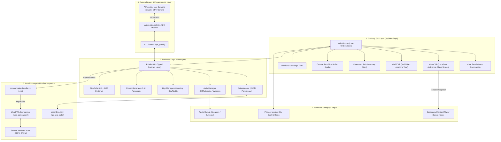
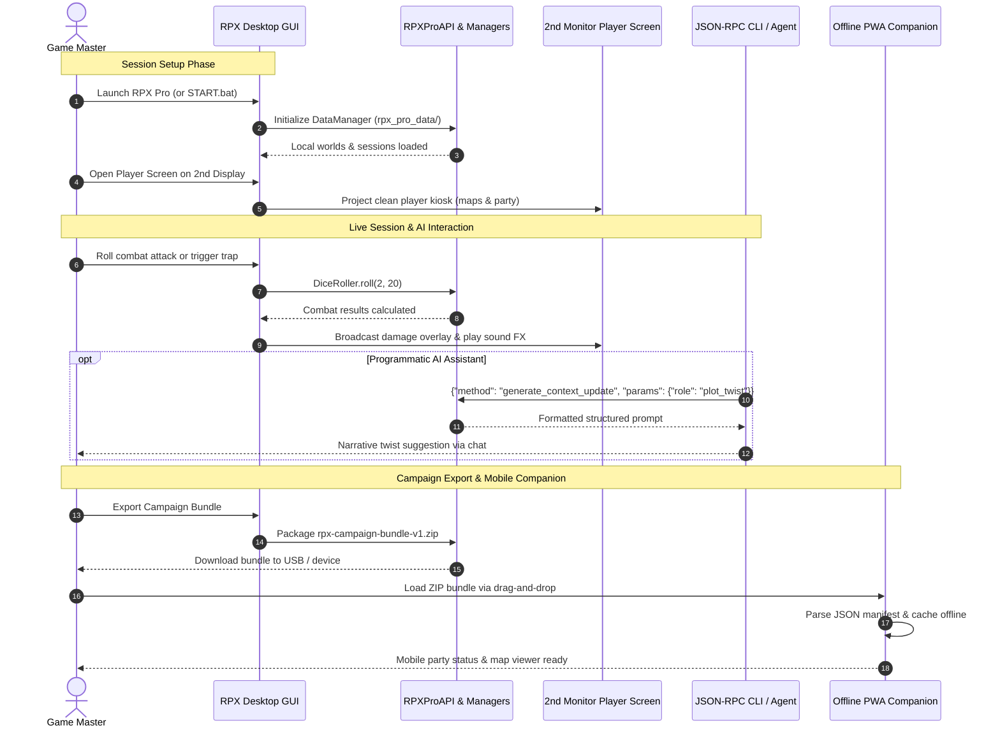

# RPX Pro — RolePlay Xtreme Professional Edition

[English](README.md) | [Deutsch](README_de.md) | [Español](README_es.md) | [简体中文](README_zh.md) | [日本語](README_ja.md) | [Русский](README_ru.md)

> Машинно-ассистированный перевод; авторитетной является английская версия ([README.md](README.md)).

[](https://github.com/entertain-and-more/rpx/releases)
[](store_package.json)
[](SECURITY.md)
[](tests/)
[](CONTRIBUTING.md)
[](web_companion/)
[](https://www.qt.io/)
[](https://www.python.org/)
[](https://github.com/entertain-and-more/rpx)
[](#sec-16)
[](SECURITY.md)
[](SECURITY.md)
[-success.svg)](THIRD_PARTY_LICENSES.txt)
[](NOTICE)
[](MARKETING-LOG.txt)
[](MARKETING-LOG.txt)
[](https://github.com/astral-sh/ruff)
[](llms.txt)
[](LICENSE)
[](https://github.com/entertain-and-more)
[](https://github.com/open-bricks)

> Профессиональный центр управления ролевыми играми для настольных приключений в формате pen & paper. Работает офлайн, бесплатен и имеет открытый исходный код.

### Метаданные релиза

| Поле | Значение |
|-------|-------|
| Версия приложения | `1.0.0` |
| Версия пакета для магазина | `1.0.0.0` |
| Статус релиза | **Не выпущена / Unveröffentlicht** (ожидаются юридическое и магазинное одобрения) |
| Издатель | Geiger (`CN=52596601-BAB4-4F3F-B182-E8F3F273B202`) |
| Политика конфиденциальности | [PRIVACY_POLICY.md](https://github.com/entertain-and-more/rpx/blob/master/PRIVACY_POLICY.md) |
| Поддержка | [GitHub Issues](https://github.com/entertain-and-more/rpx/issues) |
| Проверка конфиденциальности | `2026-08-10` |

Граница конфиденциальности: RPX Pro не выполняет автоматический сбор или передачу данных. Данные кампаний хранятся локально; промпты для внешнего ИИ-инструмента копируются или отображаются локально и покидают устройство только тогда, когда пользователь сам решает воспользоваться этим инструментом.

> [!NOTE]
> **Local-First архитектура и машиночитаемость**: RPX Pro работает на 100% офлайн. Все данные кампаний, карты, аудио и наборы правил хранятся локально в `rpx_pro_data/`. Для ИИ-агентов и рабочих процессов с внешними LLM RPX Pro предоставляет JSON-RPC CLI без зависимостей (`python -m rpx_pro.app --cli`) поверх `stdin`/`stdout` и экспортирует стандартизированные ZIP-файлы `rpx-campaign-bundle-v1`, которые может читать офлайн-PWA-компаньон из `web_companion/`.

---

## Быстрая навигация

1. [Обзор](#sec-01)
2. [Ключевые возможности](#sec-02)
3. [Целевые персоны и обнаруживаемость](#sec-03)
4. [Сравнительная матрица с альтернативами](#sec-04)
5. [Управление и инварианты времени выполнения](#sec-05)
6. [Визуальная архитектура](#sec-06)
7. [Жизненный цикл сессии и рабочий процесс](#sec-07)
8. [Экран игроков (два монитора)](#sec-08)
9. [CLI и API для интеграции с LLM](#sec-09)
10. [Веб-компаньон PWA](#sec-10)
11. [Симуляция и игровая механика](#sec-11)
12. [Система наборов правил и шаблоны](#sec-12)
13. [Установка и быстрый старт](#sec-13)
14. [Разработка и набор тестов](#sec-14)
15. [Матрица родственной экосистемы](#sec-15)
16. [Лицензии третьих сторон и управление](#sec-16)
17. [Безопасность и метаданные релиза](#sec-17)
18. [Лицензия и ответственность](#sec-18)

---

<a id="sec-01"></a>
<a id="1-overview"></a>
## 1. Обзор

RPX Pro (RolePlay Xtreme Professional Edition) — это комплексный настольный центр управления с открытым исходным кодом, предназначенный для ведущих (GM / DM), проводящих настольные ролевые игры формата pen & paper. Созданный на Python 3.10+ и PySide6 (Qt6), RPX Pro избавляет от хаоса с множеством вкладок браузера, PDF-справочников, облачных подписок и саундбордов во время живых игровых сессий.

Программа работает по бескомпромиссному принципу local-first: каждый мир кампании, изображение карты, звуковой эффект, лист характеристик персонажа и журнал транзакций хранятся исключительно в вашей локальной файловой системе в `rpx_pro_data/`. Учётная запись не требуется, внешние серверы не опрашиваются, и никакие заметки кампании не покидают ваш компьютер без вашей явной команды экспорта.


---

<a id="sec-02"></a>
<a id="2-key-features"></a>
## 2. Ключевые возможности

| Возможность | Описание |
|---------|-------------|
| **Система миров** | Многокартовые иерархии миров, виды локаций снаружи и внутри, предания наций, виды существ, автоматизация триггеров |
| **Саундборд** | Многобэкендный аудиодвижок (Qt Multimedia, pygame, резервный winsound) с триггерами drag-and-drop |
| **Световые эффекты** | Динамические вспышки молний, стробоскопические эффекты, цветокоррекция окружения день/ночь (дублируется на экран игроков) |
| **Боевой движок** | Отслеживание инициативы, бросок нескольких костей (d4–d100), расчёт критических попаданий, смягчение урона бронёй, оружие и заклинания |
| **Экран игроков** | Отдельный дисплей на втором мониторе с режимами плиток, карты, ротации и изображений, скрывающий заметки ведущего |
| **Импорт наборов правил** | Встроенные шаблоны D&D 5e (SRD 5.1), DSA 5 (абстрагированный) и Generic Fantasy, а также пользовательский импорт из JSON |
| **Интеграция с ИИ** | Генератор промптов с 7 специализированными RPG-персонами; копируемые промпты без какой-либо автоматической передачи в облако |
| **CLI / API для агентов** | JSON-RPC CLI-протокол без зависимостей поверх `stdin`/`stdout` для автономных ИИ-агентов и безголовой автоматизации |
| **PWA Web Companion** | Статический клиентский PWA, читающий локальные ZIP-архивы `rpx-campaign-bundle-v1` офлайн на мобильных устройствах |
| **Менеджер сессий** | Журналирование квестов/миссий, группировка отряда, переход к следующему раунду, автоматическое журналирование команд чата |
| **Управление персонажами**| Подробное отслеживание атрибутов, модальное окно инвентаря с ограничениями по весу и золоту, превью аватаров, шкалы голода/жажды |
| **Живая симуляция** | Настраиваемое соотношение хода времени, скорости убывания голода/жажды и случайные природные катастрофы |

---

<a id="sec-03"></a>
<a id="3-target-personas--discoverability"></a>
<a id="target-personas--discoverability"></a>
## 3. Целевые персоны и обнаруживаемость

RPX Pro разработан с учётом специфических требований четырёх основных пользовательских персон в сообществе настольных игр и разработки:

| ID персоны | Целевая аудитория | Основная потребность | Ключевое архитектурное решение RPX Pro |
|---|---|---|---|
| `[PERSONA-01]` | **Ведущие настольных ролевых игр pen & paper (GM / DM)** | Универсальный локальный пульт управления живыми сессиями с мгновенной проекцией карт, динамической световой/звуковой атмосферой и отслеживанием отряда. | Встроенный саундборд, менеджер нескольких карт с локациями снаружи/внутри, боевая система и бросок костей, динамические световые эффекты и выделенный киоск экрана игроков на втором мониторе. |
| `[PERSONA-02]` | **Игроки, заботящиеся о приватности, и создатели хоумбрю-лора** | Абсолютная приватность данных, локальный суверенитет над данными и устойчивость к отсутствию сети для пользовательского лора мира, листов персонажей и кампаний. | Строгий 100%-офлайн-дизайн без сетевого исхода (`rpx_pro_data/`), открытая лицензия MIT и переносимые ZIP-экспорты `rpx-campaign-bundle-v1`. |
| `[PERSONA-03]` | **Инженеры автономных ИИ-агентов и разработчики LLM-инструментов** | Программный безголовый API для оркестрации ИИ-ведущих, автоматизированных диалогов NPC или инспекции состояния кампании. | Стандартизированный JSON-RPC CLI-протокол поверх `stdin`/`stdout` (`python -m rpx_pro.app --cli`), предоставляющий типизированные методы без зависимостей от GUI. |
| `[PERSONA-04]` | **Мобильные спутники сессий и пользователи планшетов** | Просмотр инвентаря персонажей, ячеек заклинаний и журналов квестов за игровым столом без сложной настройки серверов и подписок. | Статический PWA-компаньон без облака (`web_companion/`), разбирающий ZIP-файлы `rpx-campaign-bundle-v1` на стороне клиента с офлайн-кэшированием через Service Worker. |

### Поисковые запросы с высоким намерением

Для облегчения технической обнаруживаемости в каталогах разработчиков, менеджерах пакетов и поисковых системах:
- `open source tabletop RPG control center python pyside6` — Полноценная офлайн-рабочая станция для ведущих pen & paper.
- `offline game master tools with second monitor player screen` — Запуск сессий на нескольких дисплеях без расходов на подписку.
- `local-first virtual tabletop companion zero network egress` — Приватный менеджер кампаний, строго хранящий лор на локальном диске.
- `json-rpc cli tabletop rpg campaign manager for ai agents` — Безголовый программный бэкенд для LLM-ведущих.
- `rpx-campaign-bundle-v1 portable campaign format pwa` — Спецификация кроссплатформенного пакета кампании и мобильный просмотрщик.
- `pyside6 qt6 roleplay xtreme pro ttrpg session manager` — Архитектура настольного приложения с сигналами Qt6 и моделями на dataclass.
- `dnd 5e dsa generic fantasy offline session manager` — SRD-совместимые шаблоны наборов правил с настройкой через JSON.
- `multi-backend soundboard and dynamic light effects tabletop rpg` — Атмосферная мультимедийная интеграция для настольных сессий.

---

<a id="sec-04"></a>
<a id="4-comparative-matrix-vs-alternatives"></a>
<a id="comparative-matrix-vs-alternatives"></a>
## 4. Сравнительная матрица с альтернативами

Следующая матрица сравнивает RPX Pro с распространёнными решениями виртуального стола и вспомогательными инструментами по 10 ключевым техническим измерениям, напрямую сопоставленным с нашими инвариантами управления:

| Техническое измерение | Инвариант управления | RPX Pro | Roll20 (облачный SaaS VTT) | Foundry VTT (самостоятельный хостинг на Node.js) | Fantasy Grounds (коммерческое настольное приложение) | Ad-hoc Pen & Paper / инструменты (бумага, Obsidian, Syrinscape) |
|:---|:---:|:---:|:---:|:---:|:---:|:---:|
| **1. Offline-First и нулевой исход данных** | `INV-LOCAL-01` | **100% офлайн (локальный диск в `rpx_pro_data/`, нулевая телеметрия)** | Нет (обязательное облачное соединение и удалённый хостинг ресурсов) | Частично (требуется демон локального веб-сервера и проброс портов) | Частично (настольное приложение с обязательной облачной проверкой лицензии) | Высокая (бумага или офлайн-заметки в markdown) |
| **2. Выполнение без привилегий** | `INV-USER-02` | **Строгий RunAsInvoker (права root/администратора не требуются)** | Песочница браузера | Демон Node.js (возможные привязки портов и запросы брандмауэра) | Установщик Windows с запросом прав администратора | Ручное редактирование файлов |
| **3. Двухэкранный дисплей игроков** | `INV-DUAL-03` | **Нативный второй монитор (киоск/плитки/ротация с изоляцией данных ведущего)** | Нет (требуется вторая вкладка браузера с входом как игрок) | Нет (требуется второе окно браузера с входом как игрок) | Частично (второй экземпляр, подключённый через localhost) | Нет (ручная картонная ширма ведущего) |
| **4. Безголовый JSON-RPC для ИИ** | `INV-RPC-04` | **Встроенный JSON-RPC через stdin/stdout (`python -m rpx_pro.app --cli`)** | Нет (закрытый веб-интерфейс, API только по подписке) | Частично (макросы JavaScript / сторонние модули сообщества) | Нет (проприетарный движок Lua без внешнего CLI) | Нет (исключительно вручную) |
| **5. Детерминированные пакеты кампаний** | `INV-BUNDLE-05` | **Стандартизированная ZIP-спецификация `rpx-campaign-bundle-v1`** | Нет (кампании заперты в облаке, экспорта «сырого» пакета нет) | Частично (сложные папки миров с файлами баз данных) | Проприетарные архивы кампаний `.mod` / `.xml` | Неструктурированные россыпи папок с документами и изображениями |
| **6. Статический офлайн-PWA-компаньон** | `INV-PWA-06` | **PWA без облака (`web_companion/`) со Service Worker** | Закрытое мобильное приложение, требующее облачную учётную запись | Нет (доступ из мобильного браузера требует запущенного сервера) | Нет (только настольная версия) | Сторонние приложения для заметок / PDF-читалки |
| **7. Лицензия и модель ценообразования** | `INV-COPYLEFT-07` | **100% бесплатно и с открытым исходным кодом (лицензия MIT, без подписок)** | Freemium с регулярными ежемесячными подписками ($5–$10/мес.) | Коммерческая разовая покупка (лицензия $50) | Коммерческое ПО ($39–$149 + покупка наборов правил) | Различается (физические книги и канцелярия) |
| **8. ИИ-интеграция с защитой приватности** | `INV-LLM-08` | **7 структурированных ИИ-ролей без автоматической передачи** | Нет / закрытые облачные бета-версии ИИ | Сторонние плагины API (требуется внешний ключ API) | Нет | Ручное копирование и вставка в веб-LLM |
| **9. Атмосферные звук и свет** | `INV-ECO-09` | **Интегрированный саундборд (Qt/pygame) + эффекты молнии/стробоскопа/день-ночь** | Базовый веб-джукбокс (ограниченное хранилище) | Модульные плейлисты окружающего звука | Звуковые ссылки через внешнюю интеграцию Syrinscape | Внешние Bluetooth-колонки / отдельные приложения |
| **10. SLA по безопасности и CI на нескольких ОС** | `INV-SLA-10` | **SLA 48 ч / триаж 5 дн. + GitHub Actions CI (Ubuntu/macOS/Windows)** | Очередь клиентских тикетов SaaS-платформы | Discord сообщества / поддержка вендора | Форум поддержки проприетарного вендора | Нет (неподдерживаемые личные инструменты) |

---

<a id="sec-05"></a>
<a id="5-governance--runtime-invariants"></a>
<a id="governance--runtime-invariants"></a>
## 5. Управление и инварианты времени выполнения

RPX Pro реализует десять формальных инвариантов управления и времени выполнения в своей архитектуре:

| ID инварианта | Каноническое название | Механизм проверки | Архитектурное правило |
|---|---|---|---|
| `INV-LOCAL-01` | **100% офлайн и Local-First без исхода данных** | Изоляция времени выполнения и тестовый контракт | Все данные миров, сессий и персонажей остаются в `rpx_pro_data/`. Никакой удалённой отправки сведений («phone-home») и аналитики. |
| `INV-USER-02` | **Пользовательский режим без привилегий и без повышения прав** | Модель безопасности процесса | Работает строго под `RunAsInvoker`; для обычного выполнения повышение до администратора не требуется. |
| `INV-DUAL-03` | **Изоляция и зеркалирование состояния на двух экранах** | Маршрутизатор отображения на сигналах | Подготовка ведущего, скрытые характеристики монстров и нераскрытый туман войны на карте никогда не проецируются на экран игроков на втором мониторе. |
| `INV-RPC-04` | **Безголовый интерфейс JSON-RPC CLI** | Набор контрактов stdio | Предоставляет программный JSON-RPC-протокол `stdin`/`stdout` (`rpx_pro.cli`) для агентной и CLI-работы. |
| `INV-BUNDLE-05` | **Детерминированный экспорт пакета кампании** | ZIP-схема (`v1`) с контрольными суммами | Полный экспорт миров, сессий и наборов правил в переносимый формат `rpx-campaign-bundle-v1`. |
| `INV-PWA-06` | **Клиентский PWA-компаньон без облака** | Набор тестов Service Worker | Статический Web/PWA-компаньон работает на 100% в браузере с офлайн-кэшированием и без запросов к серверу. |
| `INV-COPYLEFT-07` | **Разрешительное лицензирование и динамическое связывание** | Аудит лицензий SPDX | Ядро под MIT; PySide6 (LGPL-3.0) и pygame (LGPL-2.1) связываются динамически в соответствии с LGPLv3 §4. |
| `INV-LLM-08` | **Генерация ИИ-промптов с защитой приватности** | Модульные тесты генератора промптов | 7 ИИ-персон локально генерируют копируемый текст промптов; никакой автоматической передачи в облачные API LLM. |
| `INV-ECO-09` | **Модульная совместимость с родственной экосистемой** | Тесты матрицы экосистемы | Полная совместимость с родственными инструментами `entertain-and-more` и `open-bricks` (например, KlangpultLight). |
| `INV-SLA-10` | **Договорной SLA по безопасности и CI на нескольких платформах** | Многоплатформенный GitHub Actions CI | Обязательство: ответ в течение 48 ч / триаж в течение 5 дн. при непрерывном CI на Ubuntu, macOS и Windows. |

---

<a id="sec-06"></a>
<a id="6-visual-architecture"></a>
<a id="visual-architecture"></a>
## 6. Визуальная архитектура

### Четырёхвидовая проекция архитектурной топологии

```text
+---------------------------------------------------------------------------------------------------+
|               VIEW 1: CLIENT RUNTIMES, USER INTERFACES & AUTOMATION ENTRY POINTS                  |
|  - Desktop PySide6 / Qt6 Multi-Tab Workspace (Main Control Desk, Chat, Combat, Maps, Sound)        |
|  - Headless JSON-RPC CLI Runner (`python -m rpx_pro.app --cli`) over Stdio for Autonomous Agents  |
|  - Dual-Monitor Player Display Projection Kiosk (Fog-of-War, Ambient Mirrors, Hidden GM Notes)   |
|  - Zero-Cloud Mobile Web Companion PWA (`web_companion/`) with Service Worker Offline Storage     |
+---------------------------------------------------------------------------------------------------+
                                                  |
                                                  v
+---------------------------------------------------------------------------------------------------+
|                VIEW 2: RPX PRO SOVEREIGN CORE ENGINE & ORCHESTRATION PIPELINE                     |
|  - RPXProAPI Sovereign Contract Layer: Thread-Safe State Dispatcher & Event Notification Bus     |
|  - Multi-Backend Audio Engine (Qt Multimedia -> pygame -> winsound Graceful Degradation)         |
|  - Dynamic Light & Atmosphere Driver (Procedural Lightning, Strobe FX, Day/Night Color Shifts)    |
|  - Deterministic Dice Engine (Polyhedral d4..d100, Exploding Rolls, Criticals, Armor Mitigation)  |
|  - Rule Template Engine (D&D 5e SRD 5.1, DSA 5, Generic Fantasy & Custom Extensible JSON Rules)   |
|  - Privacy-Guarded AI Prompt Orchestrator (7 Specialized Personas, Local Staging Buffer)         |
+---------------------------------------------------------------------------------------------------+
                                                  |
                                                  v
+---------------------------------------------------------------------------------------------------+
|                  VIEW 3: RUNTIME PERSISTENCE, CAMPAIGN BUNDLES & LOCAL VAULT                      |
|  - Local File System Campaign Storage (`rpx_pro_data/`) in Structured JSON Data Schemas           |
|  - Standardized Portable Campaign Export: `rpx-campaign-bundle-v1` Checksummed ZIP Archive       |
|  - Audio Assets & Multi-Resolution Cartographic Tile Cache (`assets/`, `audio/`, `maps/`)         |
|  - Session Journal WAL & Audit Log (Party Trajectories, Round Sequences, In-Game Chat History)   |
+---------------------------------------------------------------------------------------------------+
                                                  |
                                                  v
+---------------------------------------------------------------------------------------------------+
|               VIEW 4: AIR-GAP DEFENSE PERIMETER, RUNASINVOKER & GOVERNANCE                        |
|  - 100% Offline-First Architecture & Zero Network Egress (`INV-LOCAL-01`): Zero Outbound Sockets|
|  - Unprivileged Execution Security Model (`INV-USER-02`): Strict `RunAsInvoker`, Non-Elevated     |
|  - Permissive Licensing & LGPL Dynamic Linking Isolation (`INV-COPYLEFT-07`): MIT Core Boundary   |
|  - Verified Governance & Runtime Invariants (`INV-LOCAL-01` through `INV-SLA-10`) Compliance      |
|  - Formal § 521 BGB Statutory Liability Disclaimer & Contractual 48h Security Response SLA       |
+---------------------------------------------------------------------------------------------------+
```

### Поток компонентов и оркестрация сигналов



---

<a id="sec-07"></a>
<a id="7-session-lifecycle--workflow"></a>
## 7. Жизненный цикл сессии и рабочий процесс



---

<a id="sec-08"></a>
<a id="8-player-screen-dual-monitor"></a>
## 8. Экран игроков (два монитора)

Экран игроков — это отдельный дисплей на втором мониторе, обращённый к игрокам за столом или транслируемый через виртуальную веб-камеру:
- **4 режима отображения**:
  - *Изображение*: полноэкранные концепт-арты локаций, портреты NPC или иллюстрации предметов.
  - *Карта*: интерактивная карта мира или подземелья с панорамированием, масштабированием и маркерами, раскрытыми игрокам.
  - *Ротация*: автоматически переключает активные плитки по настраиваемому таймеру.
  - *Плитки*: многопанельная панель, показывающая состояние отряда персонажей, журнал миссий и текущую сцену.
- **Динамические переключатели видов**: флажки позволяют ведущему на лету включать и отключать полосы HP отряда, активные квесты, журнал чата, порядок ходов, иллюстрации локаций и инвентарь.
- **Атмосферное зеркалирование**: вспышки молний, цветокоррекция день/ночь и стробоскопические эффекты окружения мгновенно дублируются с пульта ведущего.
- **Полная граница информации**: заметки ведущего, статблоки монстров, подготовка столкновений и нераскрытые локации строго изолированы и никогда не показываются на экране игроков.

---

<a id="sec-09"></a>
<a id="9-cli--api-for-llm-integration"></a>
## 9. CLI и API для интеграции с LLM

RPX Pro предоставляет JSON-RPC-протокол без зависимостей поверх стандартного ввода/вывода для автоматизированного тестирования и агентной интеграции:

```bash
python -m rpx_pro.app --cli
```

### Пример протокола

```json
{"id": 1, "method": "roll_dice", "params": {"count": 2, "sides": 20}}
{"id": 1, "result": {"dice": "2d20", "rolls": [14, 7], "total": 21}}
```

### Доступные методы
- **Миры и сессии**: `create_world`, `list_worlds`, `load_world`, `create_session`, `list_sessions`, `load_session`
- **Отряд и бой**: `create_character`, `get_character`, `heal_character`, `damage_character`, `get_inventory`, `give_item`, `roll_dice`
- **Чат и журналирование**: `send_chat_message`, `get_chat_history`, `create_mission`, `complete_mission`
- **ИИ-персоны**: `generate_start_prompt`, `generate_context_update`
- **Переносимые пакеты**: `export_campaign_bundle`, `import_campaign_bundle`

---

<a id="sec-10"></a>
<a id="10-web-companion-pwa"></a>
## 10. Веб-компаньон PWA

Статический Web/PWA-компаньон (`web_companion/`) предоставляет мобильный интерфейс для планшетов и телефонов без необходимости в серверном демоне:
- **Без облака и 100% на стороне клиента**: работает целиком в браузере на HTML5, CSS3 и современном JavaScript.
- **Офлайн-кэш Service Worker**: после загрузки оболочка кэшируется локально; последующие посещения загружаются без сетевого соединения.
- **Восстановление пакета**: запоминает и восстанавливает последний загруженный ZIP-архив `rpx-campaign-bundle-v1` после перезапуска мобильного устройства.
- **Раскладка с учётом безопасных зон**: адаптирована для дисплеев iOS и Android с отзывчивыми сенсорными элементами управления.

Локальный предпросмотр:
```bash
cd web_companion
python -m http.server 8765
```

---

<a id="sec-11"></a>
<a id="11-simulation--game-mechanics"></a>
## 11. Симуляция и игровая механика

- **Нарастание голода и жажды**: симуляция в реальном времени, рассчитываемая пропорционально игровому времени. Выдаёт предупреждения при достижении порогов 50% и 75% с настраиваемыми расовыми множителями.
- **Динамические соотношения времени**: игровое время идёт пропорционально реальному времени сессии, запуская визуальные наложения день/ночь и объявления о наступлении нового дня.
- **Природные катастрофы**: настраиваемые события окружающей среды (землетрясения, внезапные наводнения, бури, извержения вулканов), сопровождаемые визуальными стробоскопическими вспышками и записями в чате.

---

<a id="sec-12"></a>
<a id="12-ruleset-system--templates"></a>
## 12. Система наборов правил и шаблоны

RPX Pro поставляется с тремя универсальными шаблонами под открытыми лицензиями:
1. **D&D 5e (SRD 5.1)** — 9 стандартных рас, 19 видов оружия, 12 комплектов брони, 14 базовых заклинаний.
2. **DSA 5 (абстрагированный)** — 12 народов, 15 видов оружия, 7 классификаций брони, 12 заклинаний.
3. **Generic Fantasy** — 5 фэнтезийных архетипов, 10 видов оружия, 5 комплектов брони, 10 стихийных заклинаний.

Пользовательские наборы правил можно создавать в JSON и импортировать через `File > Import Ruleset`.

---

<a id="sec-13"></a>
<a id="13-installation--quickstart"></a>
## 13. Установка и быстрый старт

```bash
# Clone repository
git clone https://github.com/entertain-and-more/rpx.git
cd rpx

# Install dependencies
pip install -r requirements.txt

# Launch GUI
python RPX_Pro_1.py
# or:
python -m rpx_pro.app
```

В Windows достаточно дважды щёлкнуть по `START.bat`.

### Руководство по быстрому старту
1. **Создайте мир**: перейдите на вкладку *World* > нажмите *New World* > введите название королевства.
2. **Назначьте карту**: нажмите *Load Map...* и выберите любой файл изображения (PNG/JPG/SVG).
3. **Добавьте локации**: нажмите *Add Location*, чтобы определить города, замки или подземелья с видами снаружи/внутри.
4. **Создайте сессию**: выберите *File > New Session* и привяжите свой мир.
5. **Добавьте персонажей**: на вкладке *Characters* создайте членов отряда и NPC.
6. **Запустите экран игроков**: в *Views > Player Screen* откройте дисплей на втором мониторе для ваших игроков.

---

<a id="sec-14"></a>
<a id="14-development--test-suite"></a>
## 14. Разработка и набор тестов

```bash
# Run Python contract and unit test suite
pytest

# Verify platform source smoke
pytest tests/test_source_platform_smoke.py

# Verify release metadata alignment
python _scripts/verify_release_metadata.py

# Run Web Companion PWA test suite
node --test web_companion/tests/*.mjs

# Code quality and linter checks
ruff check .
python -m compileall -q RPX_Pro_1.py rpx_pro tests
```

---

<a id="sec-15"></a>
<a id="15-sibling-ecosystem-matrix"></a>
<a id="sibling-ecosystem-matrix"></a>
## 15. Матрица родственной экосистемы

RPX Pro выступает опорной развлекательной и настольной рабочей станцией в экосистеме `entertain-and-more` и `open-bricks`:

| Репозиторий | Область / назначение | Синергия с RPX Pro |
|---|---|---|
| [`entertain-and-more/rpx`](https://github.com/entertain-and-more/rpx) | Центр управления сессиями настольных RPG и рабочая станция ведущего | Основное хост-приложение |
| [`entertain-and-more/KlangpultLight`](https://github.com/entertain-and-more/KlangpultLight) | Лёгкий саундборд и вспомогательный аудиокомпаньон для сцены | Специализированный компаньон для автономных живых звуковых эффектов |
| [`file-bricks/SoftwareCenter`](https://github.com/file-bricks/SoftwareCenter) | Лаунчер настольного ПО и портативных инструментов | Центр распространения и запуска RPX Pro в один клик |
| [`ellmos-ai/ellmos-filecommander-mcp`](https://github.com/ellmos-ai/ellmos-filecommander-mcp) | MCP-сервер локальной файловой системы (безопасное удаление, поиск, OCR, ZIP) | Управление ресурсами кампаний и звуковой библиотекой для ИИ-агентов |
| [`ellmos-ai/ellmos-homebase-mcp`](https://github.com/ellmos-ai/ellmos-homebase-mcp) | MCP для Local-First памяти и знаний о кампаниях | Бэкенд памяти кампаний для ИИ-агентов |
| [`ellmos-ai/open-compute`](https://github.com/ellmos-ai/open-compute) | Движок автоматизации рабочего стола и взаимодействия с ОС | Автономная оркестрация рабочих процессов на уровне ОС |
| [`open-bricks`](https://github.com/open-bricks) | Зонтичная экосистема модульных local-first инструментов | Глобальные архитектурные стандарты с открытым исходным кодом |

---

<a id="sec-16"></a>
<a id="16-third-party-licenses--governance"></a>
<a id="third-party-licenses--governance"></a>
## 16. Лицензии третьих сторон и управление

RPX Pro привержен полной прозрачности лицензирования:
- **Основная лицензия**: [MIT License](LICENSE).
- **PySide6 (Qt6)**: LGPL-3.0 через официальное динамическое связывание в полном соответствии с **разделом 4 LGPLv3**. Исходный код библиотек Qt не изменялся.
- **pygame**: LGPL-2.1, динамический резервный аудиовариант.
- **Стандартная библиотека Python**: PSFL-2.0.
- **Каноническое уведомление**: [NOTICE](NOTICE).
- **Полный перечень лицензий и SBOM уровня 1**: см. [THIRD_PARTY_LICENSES.md](THIRD_PARTY_LICENSES.md) и [THIRD_PARTY_LICENSES.txt](THIRD_PARTY_LICENSES.txt).

---

<a id="sec-17"></a>
<a id="17-security--release-metadata"></a>
<a id="security--release-metadata"></a>
## 17. Безопасность и метаданные релиза

- **SLA по реагированию на уязвимости**: договорное обязательство подтвердить получение в течение 48 часов и провести триаж в течение 5 дней (см. [SECURITY.md](SECURITY.md)).
- **Выполнение без привилегий**: рассчитан на запуск обычным пользователем (`RunAsInvoker`).
- **Статус релиза**: в настоящее время **Не выпущена / Unveröffentlicht**, ожидается одобрение магазина и упаковки.

---

<a id="sec-18"></a>
<a id="18-license--liability"></a>
<a id="license--liability"></a>
## 18. Лицензия и ответственность

### Лицензия с открытым исходным кодом и указание авторства
RPX Pro — свободное программное обеспечение с открытым исходным кодом, распространяемое по **[лицензии MIT](LICENSE)**.
Каноническое уведомление об авторских правах и указание авторства проекта: см. **[NOTICE](NOTICE)**.

```
RPX Pro (RolePlay Xtreme Professional Edition)
Copyright (c) 2026 Lukas Geiger
Developed as part of the entertain-and-more gaming organization (https://github.com/entertain-and-more)
and the open-bricks open-source software ecosystem (https://github.com/open-bricks).
```

### Законодательная оговорка (§ 521 BGB, право безвозмездных услуг)
Этот проект является безвозмездным добровольным вкладом в открытое ПО, предоставляемым бесплатно («unentgeltliche Schenkung», безвозмездное дарение). В соответствии с законодательством Германии (§ 521 BGB) ответственность автора строго ограничена умыслом и грубой неосторожностью. Использование на ваш собственный риск. Никаких гарантий, обязательств по сопровождению или пригодности для определённой цели не предполагается. Дополнительно действуют условия лицензии MIT.

> **Gesetzlicher Haftungsausschluss (§ 521 BGB):**
> Dieses Projekt ist eine unentgeltliche Open-Source-Schenkung im Sinne der §§ 516 ff. BGB. Die Haftung des Autors ist gemäß **§ 521 BGB** auf **Vorsatz und grobe Fahrlässigkeit** beschränkt. Ergänzend gilt der Haftungsausschluss der MIT-Lizenz.
>
> *Краткое изложение на русском языке:* Этот проект — безвозмездный дар в виде открытого ПО в смысле §§ 516 и далее BGB. Ответственность автора согласно **§ 521 BGB** ограничена **умыслом и грубой неосторожностью**. Дополнительно действует исключение ответственности лицензии MIT.

### Обязательный SLA по реагированию на уязвимости — 48 часов
Мы обязуемся придерживаться структурированного и ответственного процесса управления уязвимостями безопасности:

| Обязательство SLA | Целевой срок реакции | Описание |
|---|---|---|
| **Первичное подтверждение** | **≤ 48 часов** | Официальное подтверждение получения отчёта о безопасности |
| **Технический триаж** | **≤ 5 рабочих дней** | Оценка серьёзности, проверка воспроизводимости и план устранения |
| **Информирование о ходе работ** | **Каждые 7 рабочих дней** | Постоянное прозрачное информирование о статусе вплоть до выпуска исправления |
| **Каналы обращения** | Конфиденциально | `security@open-bricks.org`, `security@ellmos.ai`, `support@lukasgeiger.com` или GitHub Private Security Advisory |
