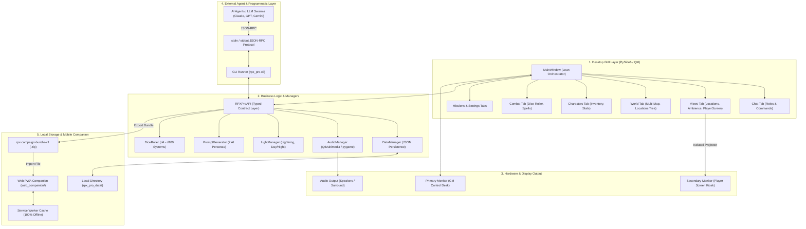
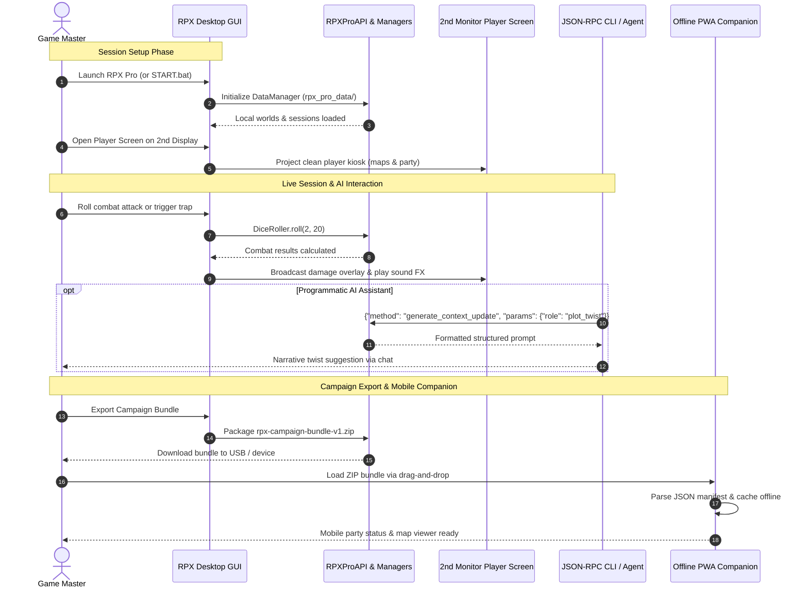

# RPX Pro — RolePlay Xtreme 专业版

[English](README.md) | [Deutsch](README_de.md) | [Español](README_es.md) | [简体中文](README_zh.md) | [日本語](README_ja.md) | [Русский](README_ru.md)

> 本文为机器辅助翻译;以英文版([README.md](README.md))为准。

[](https://github.com/entertain-and-more/rpx/releases)
[](store_package.json)
[](SECURITY.md)
[](tests/)
[](CONTRIBUTING.md)
[](web_companion/)
[](https://www.qt.io/)
[](https://www.python.org/)
[](https://github.com/entertain-and-more/rpx)
[](#sec-16)
[](SECURITY.md)
[](SECURITY.md)
[-success.svg)](THIRD_PARTY_LICENSES.txt)
[](NOTICE)
[](MARKETING-LOG.txt)
[](MARKETING-LOG.txt)
[](https://github.com/astral-sh/ruff)
[](llms.txt)
[](LICENSE)
[](https://github.com/entertain-and-more)
[](https://github.com/open-bricks)

> 面向桌面纸笔冒险的专业角色扮演游戏控制中心。支持离线使用、免费且开源。

### 发布元数据

| 字段 | 值 |
|-------|-------|
| 应用程序版本 | `1.0.0` |
| 商店包版本 | `1.0.0.0` |
| 发布状态 | **未发布 / Unveröffentlicht**(法律与商店审批待定) |
| 发布者 | Geiger (`CN=52596601-BAB4-4F3F-B182-E8F3F273B202`) |
| 隐私政策 | [PRIVACY_POLICY.md](https://github.com/entertain-and-more/rpx/blob/master/PRIVACY_POLICY.md) |
| 支持 | [GitHub Issues](https://github.com/entertain-and-more/rpx/issues) |
| 隐私审查 | `2026-08-10` |

隐私边界:RPX Pro 不会自动收集或传输任何数据。战役数据保存在本地;面向外部 AI 工具的提示词仅在本地复制或显示,只有当用户自行选择使用该工具时才会离开设备。

> [!NOTE]
> **本地优先与机器可读架构**:RPX Pro 100% 离线运行。所有战役数据、地图、音频和规则集都保存在本地的 `rpx_pro_data/` 中。针对 AI 智能体和外部 LLM 工作流,RPX Pro 提供基于 `stdin`/`stdout` 的零依赖 JSON-RPC CLI(`python -m rpx_pro.app --cli`),并可导出标准化的 `rpx-campaign-bundle-v1` ZIP 文件,供 `web_companion/` 中的离线 PWA 伴侣应用读取。

---

## 快速导航

1. [概述](#sec-01)
2. [主要功能](#sec-02)
3. [目标用户画像与可发现性](#sec-03)
4. [与替代方案的对比矩阵](#sec-04)
5. [治理与运行时不变量](#sec-05)
6. [可视化架构](#sec-06)
7. [会话生命周期与工作流](#sec-07)
8. [玩家屏幕(双显示器)](#sec-08)
9. [面向 LLM 集成的 CLI 与 API](#sec-09)
10. [Web 伴侣 PWA](#sec-10)
11. [模拟与游戏机制](#sec-11)
12. [规则集系统与模板](#sec-12)
13. [安装与快速入门](#sec-13)
14. [开发与测试套件](#sec-14)
15. [同系生态矩阵](#sec-15)
16. [第三方许可证与治理](#sec-16)
17. [安全与发布元数据](#sec-17)
18. [许可证与责任](#sec-18)

---

<a id="sec-01"></a>
<a id="1-overview"></a>
## 1. 概述

RPX Pro(RolePlay Xtreme 专业版)是一款功能全面的开源桌面控制中心,专为主持桌面纸笔角色扮演游戏的游戏主持人(GM / DM)设计。RPX Pro 基于 Python 3.10+ 和 PySide6(Qt6)构建,让您在现场游戏过程中不必再同时应付多个浏览器标签页、PDF 规则书、云订阅和音效板工具所带来的混乱。

该软件坚持毫不妥协的本地优先架构原则:每一个战役世界、地图图像、音效、角色属性表和交易日志,都只存储在您本地文件系统的 `rpx_pro_data/` 中。无需账户,不会查询任何外部服务器,未经您明确的导出指令,任何战役笔记都不会离开您的机器。


---

<a id="sec-02"></a>
<a id="2-key-features"></a>
## 2. 主要功能

| 功能 | 描述 |
|---------|-------------|
| **世界系统** | 多地图世界层级、室外与室内地点视图、国家传说、种族、触发器自动化 |
| **音效板** | 多后端音频引擎(Qt Multimedia、pygame、winsound 回退),支持拖放触发 |
| **灯光效果** | 动态闪电闪光、频闪效果、昼夜环境色调调整(同步镜像到玩家显示屏) |
| **战斗引擎** | 先攻追踪、多骰子投掷(d4–d100)、暴击计算、护甲减伤、武器与法术 |
| **玩家屏幕** | 专用第二显示器,提供平铺、地图、轮播和图像模式,同时保护 GM 笔记不外泄 |
| **规则集导入器** | 内置 D&D 5e(SRD 5.1)、DSA 5(抽象化)和通用奇幻模板,另支持自定义 JSON 导入 |
| **AI 集成** | 提示词生成器,含 7 个专业 RPG 角色设定;可复制的提示词,不会自动向云端传输任何数据 |
| **面向智能体的 CLI / API** | 基于 `stdin`/`stdout` 的零依赖 JSON-RPC CLI 协议,适用于自主 AI 智能体和无头自动化 |
| **PWA Web 伴侣** | 静态客户端 PWA,可在移动设备上离线读取本地 `rpx-campaign-bundle-v1` ZIP 压缩包 |
| **会话管理器** | 任务/使命日志、队伍分组、回合推进、聊天命令自动记录 |
| **角色管理** | 详细的属性追踪、含负重与金币上限的物品栏窗口、头像预览、饥饿/口渴计量条 |
| **动态模拟** | 可配置的时间流逝比例、饥饿/口渴衰减速率以及随机自然灾害事件 |

---

<a id="sec-03"></a>
<a id="3-target-personas--discoverability"></a>
<a id="target-personas--discoverability"></a>
## 3. 目标用户画像与可发现性

RPX Pro 旨在满足桌面游戏与开发者社区中四类主要用户画像的特定需求:

| 画像 ID | 目标受众 | 主要需求 | RPX Pro 的关键架构解决方案 |
|---|---|---|---|
| `[PERSONA-01]` | **桌面纸笔游戏主持人(GM / DM)** | 现场游戏用的一体化本地控制台,支持即时地图投影、动态灯光/音频氛围和队伍追踪。 | 内置音效板、支持室外/室内地点的多地图管理器、战斗与骰子投掷器、动态灯光效果,以及专用的第二显示器玩家展示终端。 |
| `[PERSONA-02]` | **注重隐私的玩家与自制传说创作者** | 为自定义世界传说、角色表和战役提供绝对的数据隐私、本地数据主权和离线韧性。 | 严格的 100% 离线、零网络外发设计(`rpx_pro_data/`)、MIT 开源许可证,以及可移植的 `rpx-campaign-bundle-v1` ZIP 导出。 |
| `[PERSONA-03]` | **自主 AI 智能体工程师与 LLM 工具开发者** | 用于编排 AI 地下城主、自动化 NPC 对话或检查战役状态的程序化无头 API。 | 基于 `stdin`/`stdout` 的标准化 JSON-RPC CLI 协议(`python -m rpx_pro.app --cli`),提供无需 GUI 依赖的类型化方法。 |
| `[PERSONA-04]` | **移动端会话伴侣与平板用户** | 在实体游戏桌旁查看角色物品栏、法术位和任务日志,无需复杂的服务器配置或订阅。 | 零云端的静态 PWA 伴侣(`web_companion/`),在客户端解析 `rpx-campaign-bundle-v1` ZIP 文件,并通过 Service Worker 实现离线缓存。 |

### 高意图搜索查询

为便于在开发者目录、包管理器和搜索引擎中被发现:
- `open source tabletop RPG control center python pyside6` — 面向纸笔游戏主持人的完整离线工作站。
- `offline game master tools with second monitor player screen` — 无需订阅费用的多显示器会话运行器。
- `local-first virtual tabletop companion zero network egress` — 将传说严格保留在本地磁盘上的私密战役管理器。
- `json-rpc cli tabletop rpg campaign manager for ai agents` — 面向 LLM 地下城主的无头程序化后端。
- `rpx-campaign-bundle-v1 portable campaign format pwa` — 跨平台战役包规范及移动端查看器。
- `pyside6 qt6 roleplay xtreme pro ttrpg session manager` — 采用 Qt6 信号与数据类模型的桌面应用架构。
- `dnd 5e dsa generic fantasy offline session manager` — 符合 SRD 的规则集模板,支持 JSON 自定义。
- `multi-backend soundboard and dynamic light effects tabletop rpg` — 面向桌面游戏会话的氛围多媒体集成。

---

<a id="sec-04"></a>
<a id="4-comparative-matrix-vs-alternatives"></a>
<a id="comparative-matrix-vs-alternatives"></a>
## 4. 与替代方案的对比矩阵

下表从 10 个核心技术维度,将 RPX Pro 与常见的虚拟桌面方案及临时拼凑的工具进行比较,这些维度直接对应我们的治理不变量:

| 技术维度 | 治理不变量 | RPX Pro | Roll20(云端 SaaS VTT) | Foundry VTT(自托管 Node.js) | Fantasy Grounds(商业桌面软件) | 临时纸笔/工具(纸张、Obsidian、Syrinscape) |
|:---|:---:|:---:|:---:|:---:|:---:|:---:|
| **1. 离线优先与零外发** | `INV-LOCAL-01` | **100% 离线(数据位于 `rpx_pro_data/` 本地磁盘,零遥测)** | 无(强制云连接与远程资源托管) | 部分(需要本地 Web 服务器守护进程和端口转发) | 部分(桌面应用,但强制进行云许可证检查) | 高(实体纸张或离线 Markdown 笔记) |
| **2. 无特权执行** | `INV-USER-02` | **严格 RunAsInvoker(无需 root/管理员权限)** | 浏览器沙箱 | Node.js 守护进程(可能触发端口绑定和防火墙提示) | Windows 安装程序会请求管理员权限 | 手动编辑文件 |
| **3. 双屏玩家显示** | `INV-DUAL-03` | **原生第二显示器(展示终端/平铺/轮播,并与 GM 隔离)** | 无(需要另开浏览器标签页以玩家身份登录) | 无(需要另开浏览器窗口以玩家身份登录) | 部分(通过 localhost 连接的第二个实例) | 无(手动使用纸板 DM 屏风) |
| **4. 面向 AI 的无头 JSON-RPC** | `INV-RPC-04` | **内置 stdin/stdout JSON-RPC(`python -m rpx_pro.app --cli`)** | 无(封闭的 Web 界面,API 需订阅) | 部分(JavaScript 宏/第三方社区模块) | 无(专有 Lua 引擎,无外部 CLI) | 无(纯手动) |
| **5. 确定性战役包** | `INV-BUNDLE-05` | **标准化的 `rpx-campaign-bundle-v1` ZIP 规范** | 无(战役被锁定在云端,无原始包导出) | 部分(包含数据库文件的复杂世界文件夹) | 专有的 `.mod` / `.xml` 战役压缩包 | 由文档和图像组成的无结构散乱文件夹 |
| **6. 静态离线 PWA 伴侣** | `INV-PWA-06` | **带 Service Worker 的零云端 PWA(`web_companion/`)** | 封闭的移动应用,需要云账户 | 无(移动浏览器访问需要运行服务器) | 无(仅限桌面) | 第三方笔记应用/PDF 阅读器 |
| **7. 许可证与定价模式** | `INV-COPYLEFT-07` | **100% 免费且开源(MIT 许可证,零订阅)** | 免费增值,按月循环订阅(每月 5–10 美元) | 商业一次性购买(50 美元授权费) | 商业软件(39–149 美元 + 规则集购买) | 不定(实体书籍和文具) |
| **8. 隐私保护的 AI 集成** | `INV-LLM-08` | **7 个结构化 AI 角色,零自动传输** | 无 / 封闭的云端 AI 测试版 | 第三方 API 插件(需外部 API 密钥) | 无 | 手动复制粘贴到网页 LLM |
| **9. 氛围音频与灯光** | `INV-ECO-09` | **集成音效板(Qt/pygame)+ 闪电/频闪/昼夜特效** | 基础网页点唱机(存储受限) | 基于模块的环境音频播放列表 | 通过外部 Syrinscape 集成提供音效链接 | 外接蓝牙音箱/独立应用 |
| **10. 安全 SLA 与多操作系统 CI** | `INV-SLA-10` | **48 小时 SLA / 5 天分诊 + GitHub Actions CI(Ubuntu/macOS/Windows)** | SaaS 平台客户工单队列 | 社区 Discord / 厂商支持 | 专有厂商支持论坛 | 无(无人维护的个人工具) |

---

<a id="sec-05"></a>
<a id="5-governance--runtime-invariants"></a>
<a id="governance--runtime-invariants"></a>
## 5. 治理与运行时不变量

RPX Pro 在其整个架构中强制执行十项正式的治理与运行时不变量:

| 不变量 ID | 规范名称 | 验证机制 | 架构规则 |
|---|---|---|---|
| `INV-LOCAL-01` | **100% 离线与本地优先零外发** | 运行时隔离与测试契约 | 所有世界、会话和角色数据都保留在 `rpx_pro_data/` 中。不存在远程回传或分析上报。 |
| `INV-USER-02` | **无特权用户模式与免提权** | 进程安全模型 | 严格在 `RunAsInvoker` 下运行;标准运行无需管理员提权。 |
| `INV-DUAL-03` | **双屏状态隔离与镜像** | 基于信号的显示路由器 | GM 备团内容、隐藏的怪物属性和未揭示的地图迷雾绝不会投射到第二显示器的玩家视图。 |
| `INV-RPC-04` | **无头 JSON-RPC CLI 接口** | Stdio 契约测试套件 | 提供程序化的 `stdin`/`stdout` JSON-RPC 协议(`rpx_pro.cli`),用于智能体和 CLI 操作。 |
| `INV-BUNDLE-05` | **确定性战役包导出** | 带校验和的 ZIP 模式(`v1`) | 将世界、会话和规则集完整导出为可移植的 `rpx-campaign-bundle-v1` 格式。 |
| `INV-PWA-06` | **零云端客户端 PWA 伴侣** | Service Worker 测试套件 | 静态 Web/PWA 伴侣 100% 在浏览器内运行,具备离线缓存,且不发出任何服务器请求。 |
| `INV-COPYLEFT-07` | **宽松许可与动态链接** | SPDX 许可证审计 | 核心采用 MIT;PySide6(LGPL-3.0)和 pygame(LGPL-2.1)按 LGPLv3 第 4 条合规要求进行动态链接。 |
| `INV-LLM-08` | **隐私保护的 AI 提示词生成** | 提示词生成器单元测试 | 7 个 AI 角色在本地生成可复制的提示词文本;不会自动向云端 LLM API 传输任何数据。 |
| `INV-ECO-09` | **模块化同系生态互操作性** | 生态矩阵测试 | 与 `entertain-and-more` 和 `open-bricks` 同系工具(例如 KlangpultLight)完全互操作。 |
| `INV-SLA-10` | **契约式安全 SLA 与多平台 CI** | 多操作系统 GitHub Actions CI | 48 小时响应 / 5 天分诊承诺,并在 Ubuntu、macOS 和 Windows 上持续运行 CI。 |

---

<a id="sec-06"></a>
<a id="6-visual-architecture"></a>
<a id="visual-architecture"></a>
## 6. 可视化架构

### 四视图架构拓扑投影

```text
+---------------------------------------------------------------------------------------------------+
|               VIEW 1: CLIENT RUNTIMES, USER INTERFACES & AUTOMATION ENTRY POINTS                  |
|  - Desktop PySide6 / Qt6 Multi-Tab Workspace (Main Control Desk, Chat, Combat, Maps, Sound)        |
|  - Headless JSON-RPC CLI Runner (`python -m rpx_pro.app --cli`) over Stdio for Autonomous Agents  |
|  - Dual-Monitor Player Display Projection Kiosk (Fog-of-War, Ambient Mirrors, Hidden GM Notes)   |
|  - Zero-Cloud Mobile Web Companion PWA (`web_companion/`) with Service Worker Offline Storage     |
+---------------------------------------------------------------------------------------------------+
                                                  |
                                                  v
+---------------------------------------------------------------------------------------------------+
|                VIEW 2: RPX PRO SOVEREIGN CORE ENGINE & ORCHESTRATION PIPELINE                     |
|  - RPXProAPI Sovereign Contract Layer: Thread-Safe State Dispatcher & Event Notification Bus     |
|  - Multi-Backend Audio Engine (Qt Multimedia -> pygame -> winsound Graceful Degradation)         |
|  - Dynamic Light & Atmosphere Driver (Procedural Lightning, Strobe FX, Day/Night Color Shifts)    |
|  - Deterministic Dice Engine (Polyhedral d4..d100, Exploding Rolls, Criticals, Armor Mitigation)  |
|  - Rule Template Engine (D&D 5e SRD 5.1, DSA 5, Generic Fantasy & Custom Extensible JSON Rules)   |
|  - Privacy-Guarded AI Prompt Orchestrator (7 Specialized Personas, Local Staging Buffer)         |
+---------------------------------------------------------------------------------------------------+
                                                  |
                                                  v
+---------------------------------------------------------------------------------------------------+
|                  VIEW 3: RUNTIME PERSISTENCE, CAMPAIGN BUNDLES & LOCAL VAULT                      |
|  - Local File System Campaign Storage (`rpx_pro_data/`) in Structured JSON Data Schemas           |
|  - Standardized Portable Campaign Export: `rpx-campaign-bundle-v1` Checksummed ZIP Archive       |
|  - Audio Assets & Multi-Resolution Cartographic Tile Cache (`assets/`, `audio/`, `maps/`)         |
|  - Session Journal WAL & Audit Log (Party Trajectories, Round Sequences, In-Game Chat History)   |
+---------------------------------------------------------------------------------------------------+
                                                  |
                                                  v
+---------------------------------------------------------------------------------------------------+
|               VIEW 4: AIR-GAP DEFENSE PERIMETER, RUNASINVOKER & GOVERNANCE                        |
|  - 100% Offline-First Architecture & Zero Network Egress (`INV-LOCAL-01`): Zero Outbound Sockets|
|  - Unprivileged Execution Security Model (`INV-USER-02`): Strict `RunAsInvoker`, Non-Elevated     |
|  - Permissive Licensing & LGPL Dynamic Linking Isolation (`INV-COPYLEFT-07`): MIT Core Boundary   |
|  - Verified Governance & Runtime Invariants (`INV-LOCAL-01` through `INV-SLA-10`) Compliance      |
|  - Formal § 521 BGB Statutory Liability Disclaimer & Contractual 48h Security Response SLA       |
+---------------------------------------------------------------------------------------------------+
```

### 组件流与信号编排



---

<a id="sec-07"></a>
<a id="7-session-lifecycle--workflow"></a>
## 7. 会话生命周期与工作流



---

<a id="sec-08"></a>
<a id="8-player-screen-dual-monitor"></a>
## 8. 玩家屏幕(双显示器)

玩家屏幕是一块专用的第二显示器,朝向桌边的玩家,或通过虚拟摄像头进行串流:
- **4 种显示模式**:
  - *图像*:全屏显示地点概念图、NPC 肖像或物品插图。
  - *地图*:可平移、缩放的交互式世界或地下城地图,带有玩家已揭示的标记。
  - *轮播*:按可配置的计时器自动循环切换活动的平铺面板。
  - *平铺*:多面板仪表盘,显示角色队伍状态、任务日志和当前场景。
- **动态视图开关**:复选框让 GM 可以随时切换队伍 HP 条、进行中的任务、聊天记录、行动顺序、地点美术图和物品栏的显示。
- **氛围镜像**:环境闪电闪光、昼夜色调调整和环境频闪效果会即时从 GM 控制台镜像过来。
- **完整的信息边界**:GM 笔记、怪物属性块、遭遇战准备内容以及未揭示的地点被严格隔离,绝不会显示在玩家显示屏上。

---

<a id="sec-09"></a>
<a id="9-cli--api-for-llm-integration"></a>
## 9. 面向 LLM 集成的 CLI 与 API

RPX Pro 提供基于标准输入/输出的零依赖 JSON-RPC 协议,用于自动化测试和智能体集成:

```bash
python -m rpx_pro.app --cli
```

### 协议示例

```json
{"id": 1, "method": "roll_dice", "params": {"count": 2, "sides": 20}}
{"id": 1, "result": {"dice": "2d20", "rolls": [14, 7], "total": 21}}
```

### 可用方法
- **世界与会话**:`create_world`、`list_worlds`、`load_world`、`create_session`、`list_sessions`、`load_session`
- **队伍与战斗**:`create_character`、`get_character`、`heal_character`、`damage_character`、`get_inventory`、`give_item`、`roll_dice`
- **聊天与日志**:`send_chat_message`、`get_chat_history`、`create_mission`、`complete_mission`
- **AI 角色设定**:`generate_start_prompt`、`generate_context_update`
- **可移植包**:`export_campaign_bundle`、`import_campaign_bundle`

---

<a id="sec-10"></a>
<a id="10-web-companion-pwa"></a>
## 10. Web 伴侣 PWA

静态 Web/PWA 伴侣(`web_companion/`)为平板和手机提供移动端界面,无需服务器守护进程:
- **零云端与 100% 客户端**:完全在浏览器中使用 HTML5、CSS3 和现代 JavaScript 运行。
- **Service Worker 离线缓存**:加载一次后,应用外壳会缓存在本地;之后的访问即使完全没有网络连接也能加载。
- **包恢复**:可跨移动设备重启记住并恢复上次加载的 `rpx-campaign-bundle-v1` ZIP 压缩包。
- **安全区域布局**:针对 iOS 和 Android 显示屏优化,带有响应式触控控件。

本地预览:
```bash
cd web_companion
python -m http.server 8765
```

---

<a id="sec-11"></a>
<a id="11-simulation--game-mechanics"></a>
## 11. 模拟与游戏机制

- **饥饿与口渴进程**:按游戏时间比例计算的实时模拟。在 50% 和 75% 阈值处发出警告,并支持可配置的种族倍率。
- **动态时间比例**:游戏时间与现实会话时间按比例运行,触发昼夜视觉叠加效果和日期推进公告。
- **自然灾害**:可配置的环境事件(地震、山洪、风暴、火山喷发),伴随视觉频闪闪光和聊天日志。

---

<a id="sec-12"></a>
<a id="12-ruleset-system--templates"></a>
## 12. 规则集系统与模板

RPX Pro 内置三个通用的开放许可模板:
1. **D&D 5e(SRD 5.1)** — 9 个标准种族、19 种武器、12 套护甲、14 个核心法术。
2. **DSA 5(抽象化)** — 12 个民族、15 种武器、7 种护甲分类、12 个法术。
3. **通用奇幻** — 5 种奇幻原型、10 种武器、5 套护甲、10 个元素法术。

自定义规则集可用 JSON 编写,并通过 `File > Import Ruleset` 导入。

---

<a id="sec-13"></a>
<a id="13-installation--quickstart"></a>
## 13. 安装与快速入门

```bash
# Clone repository
git clone https://github.com/entertain-and-more/rpx.git
cd rpx

# Install dependencies
pip install -r requirements.txt

# Launch GUI
python RPX_Pro_1.py
# or:
python -m rpx_pro.app
```

在 Windows 上,只需双击 `START.bat`。

### 快速入门指南
1. **创建世界**:进入 *World* 标签页 > 点击 *New World* > 输入领域名称。
2. **指定地图**:点击 *Load Map...* 并选择任意图像文件(PNG/JPG/SVG)。
3. **添加地点**:点击 *Add Location*,定义带有室外/室内视图的城镇、城堡或地下城。
4. **创建会话**:选择 *File > New Session* 并关联您的世界。
5. **添加角色**:在 *Characters* 标签页下创建队伍成员和 NPC。
6. **启动玩家显示**:在 *Views > Player Screen* 下,为您的玩家打开第二显示器的显示。

---

<a id="sec-14"></a>
<a id="14-development--test-suite"></a>
## 14. 开发与测试套件

```bash
# Run Python contract and unit test suite
pytest

# Verify platform source smoke
pytest tests/test_source_platform_smoke.py

# Verify release metadata alignment
python _scripts/verify_release_metadata.py

# Run Web Companion PWA test suite
node --test web_companion/tests/*.mjs

# Code quality and linter checks
ruff check .
python -m compileall -q RPX_Pro_1.py rpx_pro tests
```

---

<a id="sec-15"></a>
<a id="15-sibling-ecosystem-matrix"></a>
<a id="sibling-ecosystem-matrix"></a>
## 15. 同系生态矩阵

RPX Pro 是 `entertain-and-more` 与 `open-bricks` 生态中的娱乐与桌面游戏工作站核心:

| 仓库 | 范围 / 用途 | 与 RPX Pro 的协同 |
|---|---|---|
| [`entertain-and-more/rpx`](https://github.com/entertain-and-more/rpx) | 桌面 RPG 会话控制中心与 GM 工作站 | 主要应用宿主 |
| [`entertain-and-more/KlangpultLight`](https://github.com/entertain-and-more/KlangpultLight) | 轻量级音效板与舞台音频伴侣 | 面向独立现场音效的专用伴侣 |
| [`file-bricks/SoftwareCenter`](https://github.com/file-bricks/SoftwareCenter) | 桌面软件与便携工具启动器 | RPX Pro 的一键分发与启动中心 |
| [`ellmos-ai/ellmos-filecommander-mcp`](https://github.com/ellmos-ai/ellmos-filecommander-mcp) | 本地文件系统 MCP 服务器(安全删除、搜索、OCR、ZIP) | 为 AI 智能体管理战役资源与音效库 |
| [`ellmos-ai/ellmos-homebase-mcp`](https://github.com/ellmos-ai/ellmos-homebase-mcp) | 本地优先的记忆与战役知识 MCP | AI 智能体的战役记忆后端 |
| [`ellmos-ai/open-compute`](https://github.com/ellmos-ai/open-compute) | 桌面自动化与操作系统世界交互引擎 | 自主的操作系统级工作流编排 |
| [`open-bricks`](https://github.com/open-bricks) | 模块化本地优先工具的总括生态 | 全局开源架构标准 |

---

<a id="sec-16"></a>
<a id="16-third-party-licenses--governance"></a>
<a id="third-party-licenses--governance"></a>
## 16. 第三方许可证与治理

RPX Pro 致力于实现完全的许可透明:
- **核心许可证**:[MIT License](LICENSE)。
- **PySide6(Qt6)**:LGPL-3.0,通过官方动态链接方式使用,完全符合 **LGPLv3 第 4 条**。未修改 Qt 源代码库。
- **pygame**:LGPL-2.1,用作动态音频回退。
- **Python 标准库**:PSFL-2.0。
- **规范声明**:[NOTICE](NOTICE)。
- **完整许可证清单与 Level 1 SBOM**:参见 [THIRD_PARTY_LICENSES.md](THIRD_PARTY_LICENSES.md) 和 [THIRD_PARTY_LICENSES.txt](THIRD_PARTY_LICENSES.txt)。

---

<a id="sec-17"></a>
<a id="17-security--release-metadata"></a>
<a id="security--release-metadata"></a>
## 17. 安全与发布元数据

- **安全响应 SLA**:契约式 48 小时确认、5 天分诊承诺(参见 [SECURITY.md](SECURITY.md))。
- **无特权执行**:为标准用户权限运行而构建(`RunAsInvoker`)。
- **发布状态**:目前为 **未发布 / Unveröffentlicht**,等待商店与打包签核。

---

<a id="sec-18"></a>
<a id="18-license--liability"></a>
<a id="license--liability"></a>
## 18. 许可证与责任

### 开源许可证与署名
RPX Pro 是依据 **[MIT License](LICENSE)** 授权的免费开源软件。
规范的版权声明与项目署名:参见 **[NOTICE](NOTICE)**。

```
RPX Pro (RolePlay Xtreme Professional Edition)
Copyright (c) 2026 Lukas Geiger
Developed as part of the entertain-and-more gaming organization (https://github.com/entertain-and-more)
and the open-bricks open-source software ecosystem (https://github.com/open-bricks).
```

### 法定免责声明(§ 521 BGB Gefälligkeitsrecht)
本项目是一项无偿、自愿的开源贡献,免费提供("unentgeltliche Schenkung",即无偿赠与)。根据德国法律(§ 521 BGB),作者的责任严格限于故意和重大过失。使用风险自负。不承担任何担保、维护保证或对特定用途适用性的责任。MIT 许可证条款同样适用。

> **Gesetzlicher Haftungsausschluss (§ 521 BGB):**
> Dieses Projekt ist eine unentgeltliche Open-Source-Schenkung im Sinne der §§ 516 ff. BGB. Die Haftung des Autors ist gemäß **§ 521 BGB** auf **Vorsatz und grobe Fahrlässigkeit** beschränkt. Ergänzend gilt der Haftungsausschluss der MIT-Lizenz.
>
> **中文摘要(德语法定免责声明):** 本项目是《德国民法典》第 516 条及以下各条意义上的无偿开源赠与。依据 **§ 521 BGB**,作者仅对**故意和重大过失**承担责任。此外,MIT 许可证的免责声明同样适用。

### 具有约束力的 48 小时安全响应 SLA
我们承诺建立结构化且负责任的安全漏洞管理流程:

| SLA 承诺 | 响应目标 | 描述 |
|---|---|---|
| **初步确认** | **≤ 48 小时** | 正式确认已收到安全报告 |
| **技术分诊** | **≤ 5 个工作日** | 严重性评分、可复现性检查和修复计划 |
| **进展更新** | **每 7 个工作日** | 在补丁发布之前持续透明地沟通状态 |
| **报告渠道** | 保密 | `security@open-bricks.org`、`security@ellmos.ai`、`support@lukasgeiger.com`,或 GitHub 私有安全公告 |
